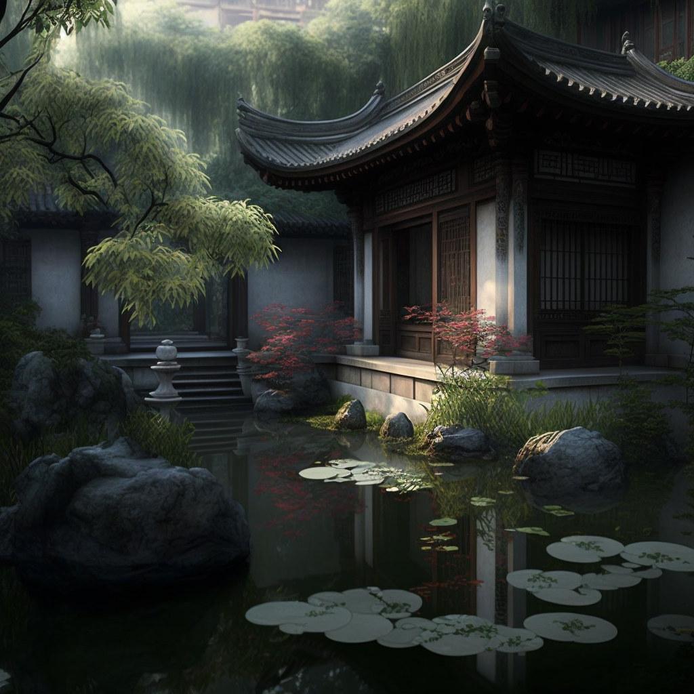
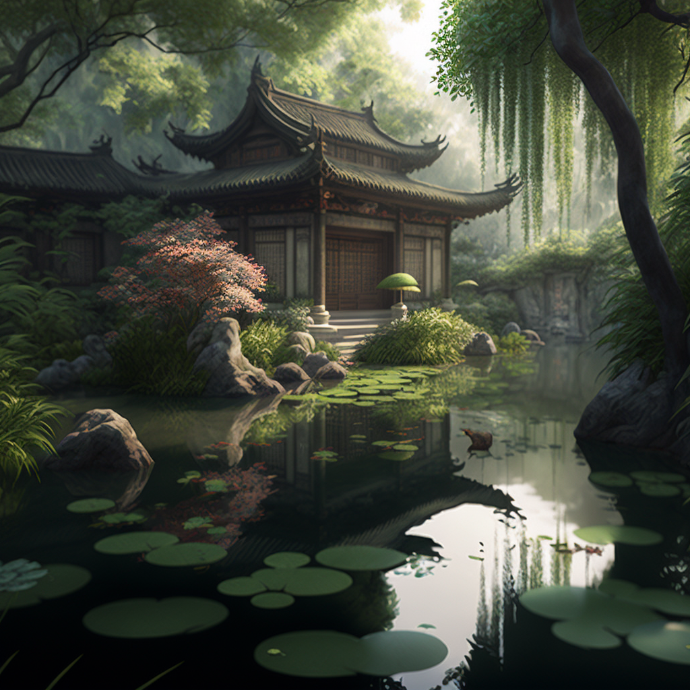
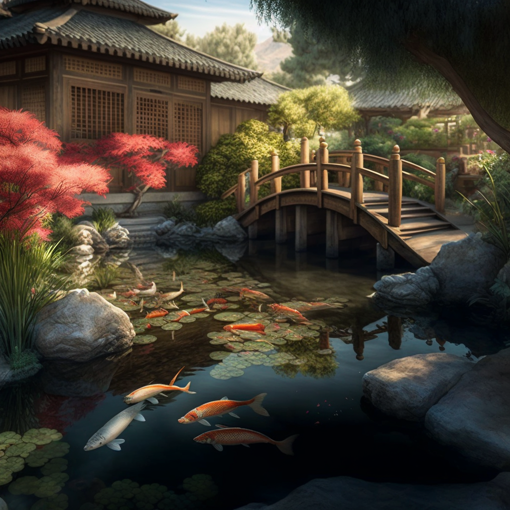
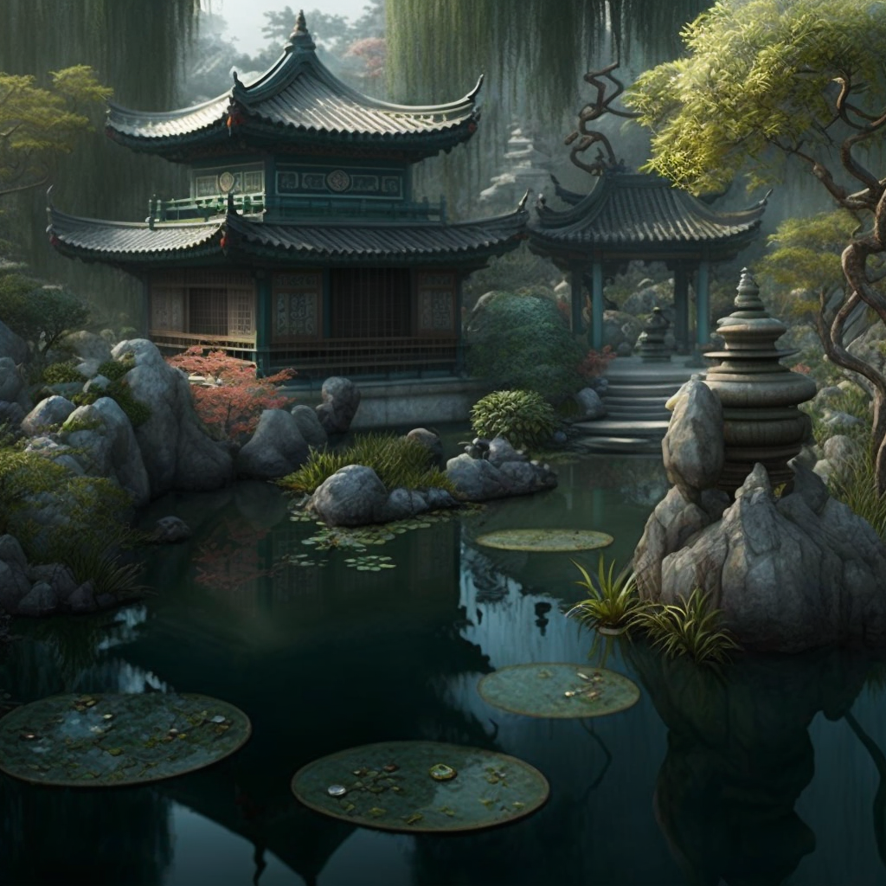
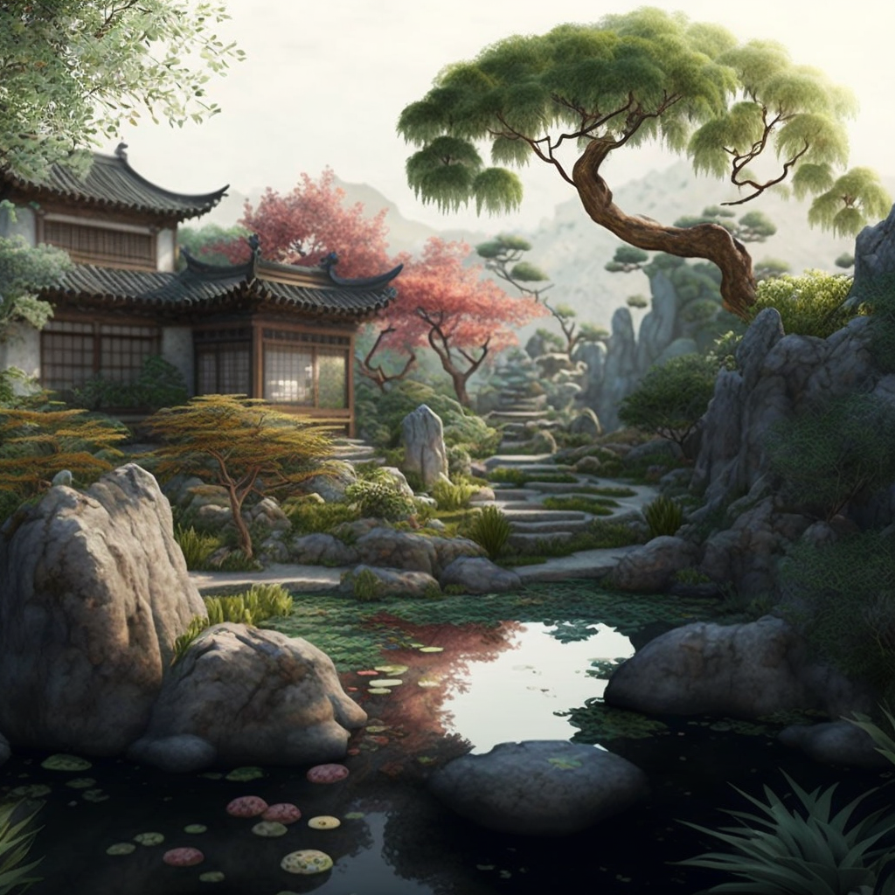
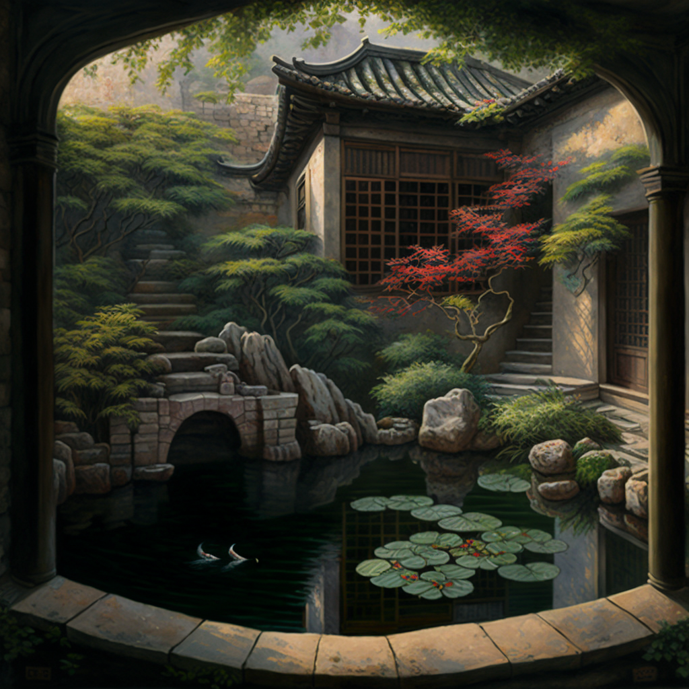
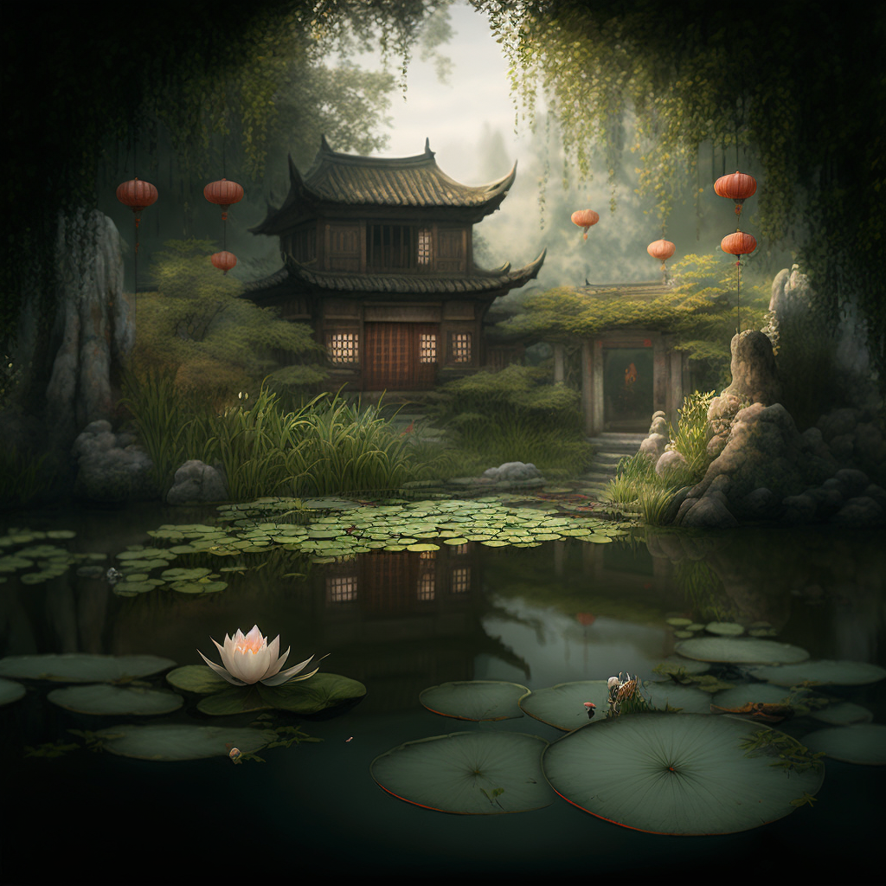

## Introduction

Creating a traditional Chinese garden in your own backyard can be a rewarding and meditative experience. Chinese gardens are known for their serenity, harmony, and balance, and by incorporating these elements into your own backyard, you can create a space that not only looks beautiful but also promotes a sense of well-being.

Chinese gardens have a rich history dating back over 3,000 years. They were originally designed for the wealthy and powerful as a way to escape the hustle and bustle of daily life and connect with nature. Chinese gardens are not just a collection of plants and rocks but a reflection of the culture's philosophical and religious beliefs. They are designed to be a microcosm of the natural world, and they are meant to be walked through and experienced.

The purpose of this article is to teach you how to create a traditional Chinese garden in your own backyard. Whether you have a small courtyard or a large backyard, this guide will provide you with the information and inspiration you need to create a serene and harmonious space. We will cover everything from understanding Chinese garden design principles and choosing the right plants, to incorporating water elements and creating a secluded space.

It's essential to note that the Chinese garden style is not a one-size-fits-all. There are different styles like the scholar's garden, imperial garden, and zen garden. Each style has its unique characteristics, but all share a common goal, which is to create a harmonious balance between nature and man-made elements. The article will focus on the general principles of Chinese garden design, but readers can pick and choose elements that suit their preferences and needs.

In this article, you will learn about the key design principles that are used in Chinese gardens, such as symbolism, balance, and harmony. We will also discuss the common elements found in Chinese gardens, including rocks, water, bridges, and plants, and how to incorporate them into your own backyard. Additionally, we will talk about how to choose the right plants, incorporating water elements, and creating a secluded space.

By the end of this article, you will have a clear understanding of how to create a Chinese garden style in your own backyard. You will be equipped with the knowledge and tools needed to design and create a beautiful and peaceful garden that reflects the traditional Chinese style. So, let's begin our journey and learn how to create your very own Chinese oasis in the comfort of your own backyard.

## Understanding Chinese Garden Design Principles

Creating a traditional Chinese garden in your backyard requires an understanding of the key design principles that are used in Chinese gardens. These principles include symbolism, balance, and harmony. By incorporating these principles into your garden design, you can create a space that not only looks beautiful but also promotes a sense of well-being.

Symbolism is a crucial element in Chinese gardens. Each element in the garden, from the placement of rocks to the choice of plants, has a symbolic meaning. For example, rocks are often used in Chinese gardens to symbolize mountains and represent the natural world. Similarly, a bridge in a Chinese garden may symbolize the journey from this world to the next. By understanding the symbolism of each element, you can create a garden that tells a story and has a deeper meaning.

Balance is another important principle in Chinese garden design. The garden should be balanced both visually and symbolically. For example, a garden that has a large pond on one side and a small rock garden on the other would not be considered balanced. To create balance in your garden, you should consider the size, shape, and placement of each element.

Harmony is also an essential principle in Chinese garden design. The garden should be in harmony with the natural environment and should promote a sense of peace and tranquility. This can be achieved by incorporating elements such as water and rocks, which are believed to have a calming effect on the mind and body.

Common elements found in Chinese gardens include rocks, water, bridges, and plants. Rocks are often used to symbolize mountains and represent the natural world. They are also used to create a sense of depth and layering in the garden. Water is another essential element in Chinese gardens. It is believed to have a calming effect on the mind and body and is often used to symbolize the flow of life. Bridges are also commonly found in Chinese gardens, and they symbolize the journey from this world to the next. Finally, plants are an essential element in Chinese gardens and are often chosen for their symbolism and beauty.

Incorporating symbolism, balance, and harmony into your garden design will help create a space that not only looks beautiful but also promotes a sense of well-being. By understanding the symbolism of each element and how to incorporate it into your garden, you can create a garden that tells a story and has a deeper meaning. The key is to take your time, plan and execute the design with care and attention to detail. This will bring your garden to life and make it a true reflection of Chinese culture and philosophy.

## Choosing the Right Plants

When it comes to creating a traditional Chinese garden in your own backyard, choosing the right plants is essential. Not only do the plants need to be visually pleasing, but they also need to have a symbolic meaning that is consistent with Chinese garden design principles.

Traditional Chinese plants include bamboo, cherry blossoms, chrysanthemums, and peonies. Bamboo symbolizes resilience and strength, while cherry blossoms symbolize the fleeting nature of life. Chrysanthemums represent autumn and longevity, and peonies symbolize wealth and nobility.

It's important to note that not all traditional Chinese plants will thrive in every climate. It's essential to choose plants that are well-suited to the climate in your area. For example, bamboo is native to Asia and may not be able to survive in colder climates. In such cases, it's best to choose plants that are native to your area and have similar symbolic meanings.

Creating a sense of depth and layering in the garden with plants is also an essential aspect of Chinese garden design. This can be achieved by using a combination of small, medium, and large plants. For example, a small rock garden with a few small shrubs can be used to create a sense of depth and layering. Similarly, by using a combination of tall and short plants, you can create a sense of dimension in your garden.

When choosing plants, it's also important to consider their growth habits. Some plants, such as bamboo, can become invasive if not properly contained. It's important to choose plants that will not become too large for the space you have available and that can be maintained with ease.

## Incorporating Water Elements

Water is an essential element in traditional Chinese gardens and is often used to symbolize the flow of life. Incorporating water elements such as ponds, fountains, and waterfalls can add a sense of tranquility and serenity to your garden, creating a peaceful and harmonious space.

Ponds are one of the most popular water elements in Chinese gardens. They can be used to symbolize the natural world and can be designed to incorporate different types of fish and aquatic plants. Fountains are also commonly found in Chinese gardens and can be used to create a sense of movement and energy. They can be designed to incorporate different types of water features such as cascading water, mist, and light. Waterfalls are another popular water element in Chinese gardens and can be used to create a sense of movement and flow. They can be designed to incorporate different types of rocks and plants to create a natural and harmonious look.

When incorporating water elements into your garden, it's important to consider the overall design and the symbolism of the elements. For example, a pond in the center of the garden can symbolize the center of the universe, while a fountain in the corner of the garden can symbolize the flow of energy. It's important to keep in mind the symbolism of each element and how it relates to the overall design of the garden.

It's also important to consider the practical aspects of incorporating water elements into your garden. For example, a pond or fountain will require regular maintenance, such as cleaning and refilling, to keep it looking its best. It's important to choose a water feature that is easy to maintain and that can be incorporated into the overall design of the garden.

When it comes to incorporating water elements in your Chinese garden, the key is to strike a balance between the practical and the symbolic. By incorporating water elements that are easy to maintain and that have a symbolic meaning consistent with Chinese garden design principles, you can create a beautiful and harmonious garden that promotes a sense of well-being.

## Creating a Secluded Space

One of the essential elements of a traditional Chinese garden is the creation of a secluded space. This can be achieved by using walls, fencing, or gates to create a sense of privacy and mystery. A secluded space in a Chinese garden can provide a place to escape the hustle and bustle of daily life and connect with nature.

Walls and fencing are commonly used in Chinese gardens to create a sense of privacy and seclusion. These can be made from a variety of materials such as wood, stone, or metal and can be designed to incorporate different types of plants and foliage. For example, a wall covered in ivy can create a sense of seclusion and privacy, while a metal fence can create a sense of elegance and sophistication.

Gates are also commonly found in Chinese gardens and can be used to create a sense of mystery and intrigue. These can be made from a variety of materials such as wood, stone, or metal and can be designed to incorporate different types of plants and foliage. For example, a wooden gate with a bamboo arbor can create a sense of mystery and intrigue, while a stone gate with a water feature can create a sense of tranquility and serenity.

When creating a secluded space in your Chinese garden, it's important to consider the overall design and symbolism of the elements. For example, a secluded space in the center of the garden can symbolize the center of the universe, while a secluded space in the corner of the garden can symbolize a place of refuge. It's important to keep in mind the symbolism of each element and how it relates to the overall design of the garden.

It's also important to consider the practical aspects of creating a secluded space. For example, a secluded space that is too small or too large may not be practical for the intended use. It's important to choose a secluded space that is the right size and that can be incorporated into the overall design of the garden.

## Putting it all Together

Now that you understand the key design principles and elements of a traditional Chinese garden, it's time to put it all together and create your own backyard oasis. This section will provide a step-by-step guide for designing and creating a Chinese garden in your backyard, as well as tips for maintaining and caring for your garden.

#### Step 1: Plan and Design

The first step in creating a Chinese garden in your backyard is to plan and design your garden. This includes determining the size and shape of your garden, selecting the elements you want to incorporate, and deciding on a layout that incorporates the principles of symbolism, balance, and harmony.

#### Step 2: Choose the Right Plants

Once you have a plan for your garden, the next step is to choose the right plants. This includes selecting plants that are visually pleasing, have symbolic meaning, and are well-suited to your climate. It's also important to create a sense of depth and layering with plants, and to consider their growth habits.

#### Step 3: Incorporate Water Elements

Incorporating water elements such as ponds, fountains, and waterfalls can add a sense of tranquility and serenity to your garden. It's important to consider the overall design and symbolism of the elements, as well as the practical aspects of maintenance, when incorporating water elements into your garden.

#### Step 4: Create a Secluded Space

Creating a secluded space in your Chinese garden is an essential element of traditional Chinese garden design. This can be achieved by using walls, fencing, or gates to create a sense of privacy and mystery. It's important to consider the overall design and symbolism of the elements, as well as the practical aspects of creating a secluded space.

#### Step 5: Final Touches

Once all the elements of your garden have been put in place, it's time to add the final touches. This includes adding lighting, incorporating accessories such as statues, and making any necessary adjustments to ensure your garden is true to Chinese garden design principles.

#### Tips

When it comes to maintaining and caring for your Chinese garden, it's important to keep the following tips in mind:

- Regularly prune and trim your plants to keep them healthy and looking their best.
- Keep an eye out for pests and diseases, and take appropriate action if necessary.
- Regularly check and maintain any water features in your garden, such as ponds or fountains.
- Keep an eye on the weather and take appropriate measures to protect your garden during extreme conditions.

## Conclusion

Creating a traditional Chinese garden in your own backyard can be a rewarding and meditative experience. By incorporating the principles of symbolism, balance, and harmony, choosing the right plants, incorporating water elements, creating a secluded space, and putting it all together, you can create a beautiful and harmonious garden that promotes a sense of well-being and reflects traditional Chinese culture.

In this article, we have discussed the key design principles and elements of a traditional Chinese garden, including understanding Chinese garden design principles, choosing the right plants, incorporating water elements, and creating a secluded space. We have also provided a step-by-step guide for designing and creating a Chinese garden in your backyard, as well as tips for maintaining and caring for your garden.

We hope that this article has provided you with the knowledge and inspiration you need to create your own Chinese garden in your backyard. We encourage you to share your own Chinese garden creations with us and to continue exploring the world of Chinese garden design. If you need additional inspiration or information, you can refer to other resources such as books, videos, and online tutorials.

In conclusion, creating a Chinese garden can be a fun and meditative process that brings the traditional culture and philosophy to life. It's a space for you to unwind, relax and find inner peace. With the right approach and attention to detail, you can create a beautiful and harmonious garden that reflects the traditional Chinese style, and brings joy and serenity to your daily life.
