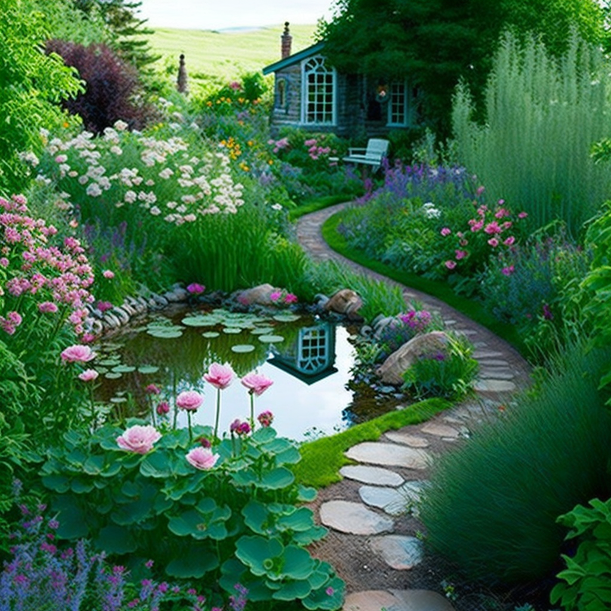
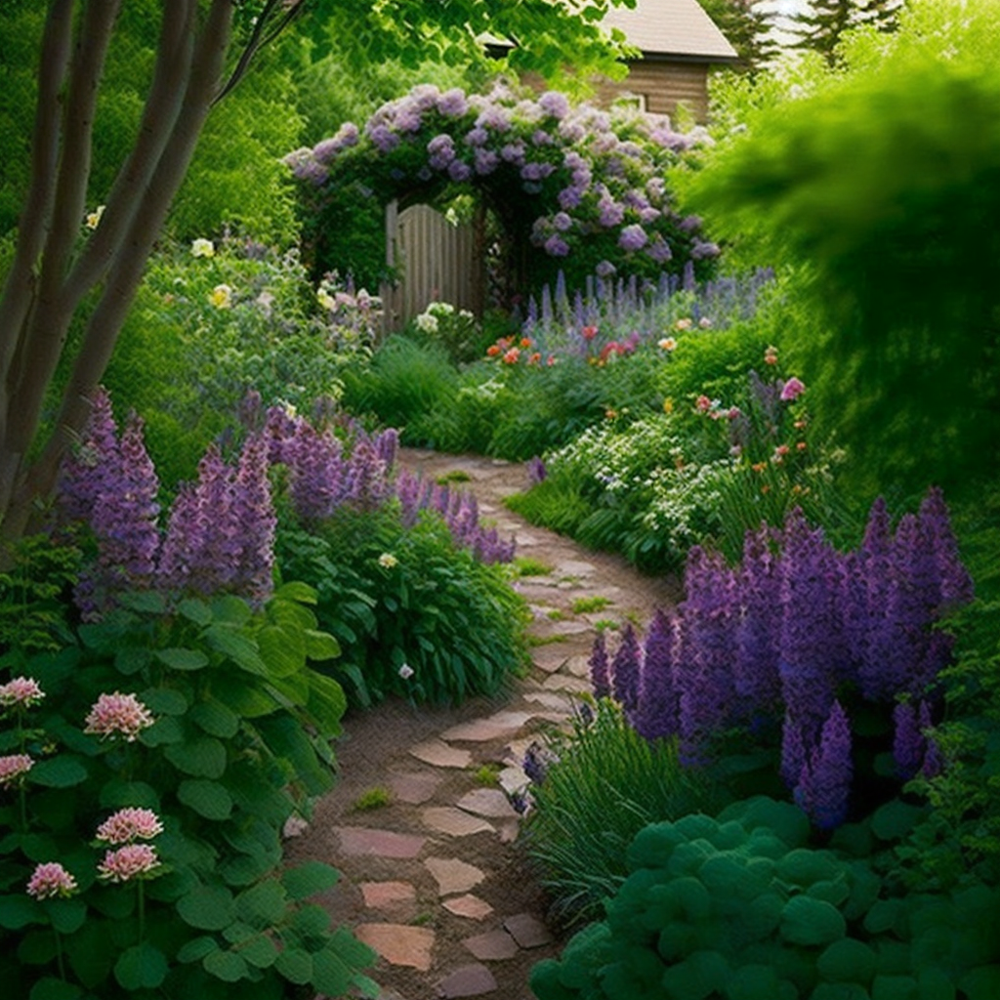

## Introduction to Cottage Gardens

#### Definition

Cottage gardens are a style of gardening that is characterized by informality and a mix of flowers, herbs, and vegetables. They often have a romantic, relaxed feel and are designed to look like they have evolved naturally over time.

#### Benefits

Cottage gardens offer a number of benefits, including providing a wide variety of color and texture, attracting wildlife, and producing fresh produce and herbs. They can also be a great way to create an outdoor space that is both functional and beautiful. Additionally, Cottage gardens usually require less maintenance than formal gardens, providing a more laid-back approach to gardening. Furthermore, these gardens are also known for their capacity to provide sensory delight, not just from the colorful flowers and different foliage but also from the fragrance and taste of the herbs and vegetables.

## Planning Your Cottage Garden

#### Location Selection

The first step in creating a cottage garden is choosing the right location. Look for a spot that gets plenty of sunlight and has well-drained soil. If your garden will be visible from your home, you may also want to consider the view and how it will look from inside.

#### Size Considerations

Consider the size of your garden space and what you want to include in it. A small cottage garden can be just as beautiful as a large one, but will require different plant choices and a different layout. Think about what you want to include in your garden, such as flowers, herbs, vegetables, and hard landscaping elements like paths and structures.

#### Style Ideas

Cottage gardens can be designed in a variety of styles, from traditional English to more modern and contemporary. Consider what style would best suit your space and what you are looking to achieve. Research on different garden styles and take inspiration from photos and examples of different cottage gardens, you could decide on the style that you would like to emulate.

#### Decide on theme

Cottage garden themes are abound, decide if you would like to focus on a particular color scheme, or feature a specific type of flowers (such as roses) or focus on a specific time of the year (e.g. spring blooms) or even incorporate a historical or cultural theme in the garden. This will help you decide on the plants to choose and the overall style and aesthetic of your garden.

## Soil Preparation

#### Testing the Soil

Before you begin planting, it's important to test your soil. This will help you determine its pH level and nutrient content, which will guide your decision-making when it comes to what plants to choose and what kind of fertilizer or amendment to use. You can purchase soil testing kits from a garden center or have a soil sample analyzed by your local cooperative extension office.

#### Adding Organic Matter

Once you have a good understanding of the soil conditions in your garden, you'll be able to improve the soil by adding organic matter. This can be done by adding compost, well-rotted manure, or other organic materials to the soil. Incorporating organic matter is important for improving soil structure, providing essential nutrients and increasing water-holding capacity of soil. This will help ensure that your plants have the right conditions to thrive.

It's also a good idea to amend soil with specific nutrient-rich materials depending on the plants you want to grow, for example, adding peat moss to acidify soil for blueberries, or bone meal to add phosphorous for plants that are heavy feeders.

#### Improving Drainage

If your soil has poor drainage, you may also need to add materials like sand or gravel to improve it. Poor drainage can lead to waterlogged roots which can lead to plant stress and death. Improving drainage before planting will help ensure that your plants have the right conditions to grow and thrive.

## Plant Selection

#### Choosing Flowers

A cottage garden is defined by its mix of flowers, so it's important to choose a variety of different types. Some flowers that are often included in cottage gardens are roses, peonies, daisies, foxgloves, and lupines. Consider the color, shape, size and blooming period of the flowers you want to include, and group them by these attributes to achieve a harmonious and cohesive look. Additionally, choose a mix of annuals, perennials, and bulbs for a continual display of color throughout the seasons.

#### Choosing Shrubs

Shrubs can add structure and shape to your cottage garden, and can also provide interest in the form of berries, leaves, or bark. Some popular shrubs for cottage gardens include hydrangeas, lilacs, and spireas. Consider the height and shape of the shrub, as well as its growth habit and blooming period when selecting.

#### Choosing Trees

Trees can add height and shade to a cottage garden and provide a backdrop for other plants. Some popular trees for cottage gardens include Dogwood, Crabapple, and Cherry. Consider the size, shape, and blooming period of the tree when selecting, and make sure it will fit within the space you have.

_Note: Be sure to choose plants that are suitable for the climate and soil conditions in your area. And, don't forget to include native plants in your garden as they are generally easier to grow and support local wildlife._

## Hard Landscaping

#### Paths

Paths are an important feature of a cottage garden as they create movement and flow throughout the garden. Paths can be made from a variety of materials such as gravel, brick, stone, or wood. They can be curved, straight, or meandering depending on the style and design of your garden. Consider the width, shape, and location of the paths, as well as how they will connect different areas of the garden.

#### Fences

Fences can be a great way to create boundaries and privacy in your cottage garden. They can be made from wood, metal, or other materials and can be designed in a variety of styles such as picket, ranch-style, or lattice. Consider the height, style, and material of the fence, as well as how it will complement the overall design of your garden.

#### Structures

Structures such as arbors, pergolas, and gazebos can add interest and function to a cottage garden. These can provide shade, support for climbing plants, and a focal point in the garden. Consider the style, size, and location of the structure, as well as how it will be used.

#### Garden ornaments

Garden ornaments such as statues, bird baths, and garden art, can be a wonderful addition to a cottage garden. It can enhance the aesthetic appeal and create a sense of charm and personality.

When planning the hardscaping, make sure to consider how they will complement and enhance the overall design and layout of your cottage garden, and not to overcrowd it.

## Planting

#### Planting Depth

The depth at which you plant your flowers, shrubs, and trees is important for their success. Be sure to plant at the same depth that they were growing in their pots or containers. Planting too deep can lead to rot, while planting too shallow can lead to drying out.

#### Plant Spacing

Proper plant spacing is also important for the health of your garden. Be sure to space your plants far enough apart so that they have room to grow and flourish. Crowded plants can compete for light, water, and nutrients, which can lead to poor growth and disease. It's also important to consider the mature size of the plant when determining spacing, as some plants will grow larger than others.

#### Plant Groupings

Grouping plants together by color, height, or blooming period can create an interesting and cohesive look in your cottage garden. Consider the texture and form of the plants, and try to create a balanced composition of different heights, shapes, and colors. This will create visual interest throughout the seasons.

#### Companion Planting

Companion planting is a gardening technique that utilizes the benefits of plants in close proximity to each other. For example, planting certain flowers or herbs near vegetables can act as natural pest control, or planting tall plants next to short ones can provide shade for the shorter ones. There are many benefits of companion planting and it's worth researching and applying it on your cottage garden.

#### Consider the Layout

Consider the overall layout of your garden when planting. Think about how you want the plants to grow and how they will look once they reach maturity. This will ensure that your garden has visual interest and balance throughout the seasons.

## Watering and Feeding

#### Water Requirements

Different plants have different water requirements, so it's important to be mindful of this when watering your garden. Overwatering can lead to root rot, while underwatering can cause plants to wilt and die. A general rule of thumb is to water deeply and infrequently, rather than shallowly and frequently. Be sure to water at the base of the plant, rather than on the leaves, to avoid disease.

#### Feeding Needs

Plants also have different feeding needs, so it's important to be aware of this when fertilizing your garden. Over-fertilizing can lead to lush, spindly growth and can damage the soil, while under-fertilizing can lead to weak, stunted growth. The general rule is to use fertilizer according to the package instructions, and consider the specific needs of your plants.

#### Organic vs Inorganic Fertilizers

Organic fertilizers are made from natural materials such as bone meal, blood meal, and fish emulsion. Organic fertilizers tend to release their nutrients slowly and therefore do not have to be applied as often. Inorganic fertilizers, which are synthesized chemically, are typically quicker to release their nutrients, but may have a negative impact on the environment. If you prefer an organic approach, compost or homemade organic fertilizers like comfrey or nettle tea are a great choice.

#### pH Levels

The pH level of your soil can affect how easily plants can absorb nutrients. In general, most plants prefer a soil pH between 6 and 7, but some plants such as blueberries, rhododendrons, and azaleas prefer a pH between 4 and 5. If you are unsure of the pH level of your soil, you can test it and adjust it accordingly.

Watering and feeding properly will help ensure that your plants have the right conditions to grow and thrive, while avoiding over or under nourishment.

## Maintenance

#### Pruning 

Pruning is an important part of maintaining a cottage garden. Pruning helps to keep plants in shape, remove dead or diseased wood, and encourage new growth. Different plants have different pruning needs, so be sure to research the specific needs of each plant in your garden. Prune after flowering is a general rule of thumb.

#### Mulching

Mulching is another important part of maintaining a cottage garden. Mulch helps to keep the soil moist, control weeds, and regulate soil temperature. Mulch can be made from a variety of materials such as straw, bark, or leaves. Spread a 2-4 inch layer of mulch around your plants, taking care not to pile it up against the base of the stems.

#### Weeding

Regular weeding is necessary to keep a cottage garden looking tidy. Weeds can compete with your plants for water and nutrients, so it's important to remove them as soon as you notice them. Hand-weeding, hoeing, and mulching are all effective ways of controlling weeds.

#### Deadheading 

Deadheading is the process of removing spent flowers from your plants. Deadheading will prolong the blooming period of your plants and prevent them from going to seed. Additionally, it will also give them an opportunity to grow new blooms.

#### Pest and Disease Control

Pests and diseases can cause serious damage to your garden if not controlled. Keep an eye out for any signs of insect damage, disease, or fungus on your plants, and take action as soon as you notice them. Organic pest and disease control methods such as using neem oil or garlic spray are effective, but when in doubt, it's best to consult a horticulturist.

Proper maintenance will help ensure that your cottage garden is healthy and beautiful for years to come.

## Attracting Wildlife

#### Birdhouses

Birdhouses can be a great way to attract birds to your garden. Birds not only add beauty and interest to your garden, but they also help control pests. Be sure to choose the right type of birdhouse for the birds you want to attract and place it in a location that is protected from the elements and predators.

#### Bird Feeders

Bird feeders can also be used to attract birds to your garden. Be sure to choose the right type of feeder for the birds you want to attract, and fill it with the appropriate type of food. Be sure to keep the feeder clean and free from mold to prevent the spread of disease.

#### Butterfly and Bee-Friendly Plants

In addition to birds, you can also attract butterflies and bees to your garden by planting a variety of flowers that are rich in nectar. Butterflies and bees are important pollinators and will help to improve the health of your garden.

#### Water Feature

A water feature such as a pond or a bird bath can also attract a variety of wildlife to your garden including birds, butterflies, and dragonflies. The water feature will serve as a source of drinking water, and a place to bathe, drink and hunt for insects.

#### Wildlife Habitat

Creating a wildlife-friendly habitat will provide food, water, and shelter for various species of birds, butterflies, and mammals. Incorporating a mixture of different types of plants, trees and shrubs, and a variety of structures such as birdhouses, feeders, and nesting boxes will create a diverse and inviting habitat for wildlife.

By incorporating a variety of elements that attract wildlife, you'll be able to enjoy the beauty and diversity of nature in your cottage garden.

## Conclusion

Cottage gardens are a beautiful and functional way to enhance your outdoor space. They offer a wide variety of color, texture, and interest, and can also provide fresh produce and herbs. They also attract wildlife and provide a peaceful, relaxing space for you to enjoy. Cottage gardens can be created in a variety of styles, from traditional English to more modern and contemporary, and can be tailored to your specific needs and preferences.

Creating a cottage garden takes planning, preparation, and ongoing maintenance, but the end result is well worth the effort. Remember to choose the right location, style, and plants for your garden, and be mindful of soil preparation, watering, and feeding needs. Incorporating hardscaping and garden ornaments will also enhance the overall design and aesthetic of your cottage garden. Finally, include elements that attract wildlife, and you'll be able to enjoy the beauty and diversity of nature in your garden. With care, a cottage garden can be a source of joy and inspiration for many years to come.
