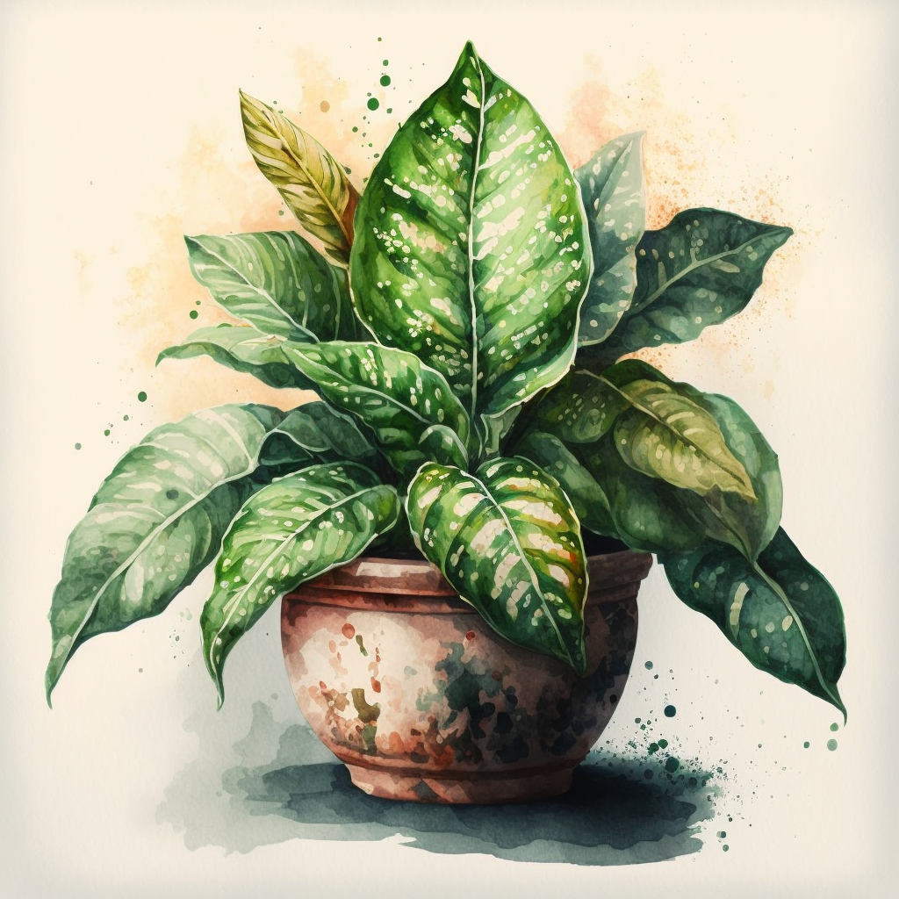
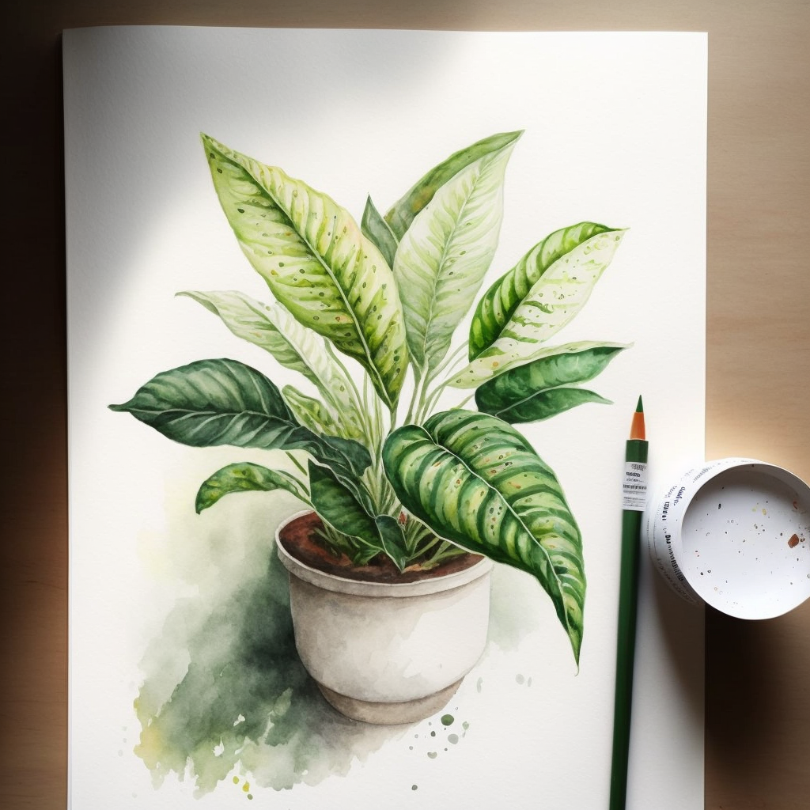
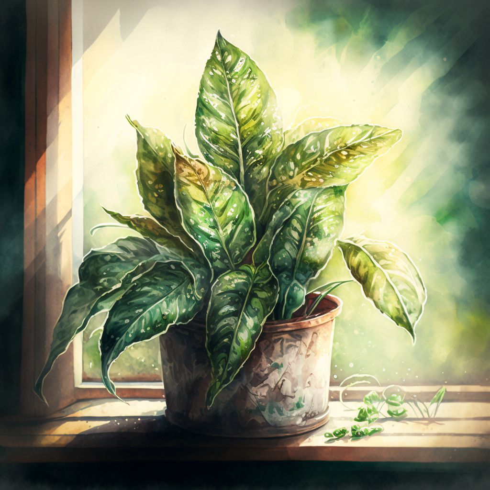
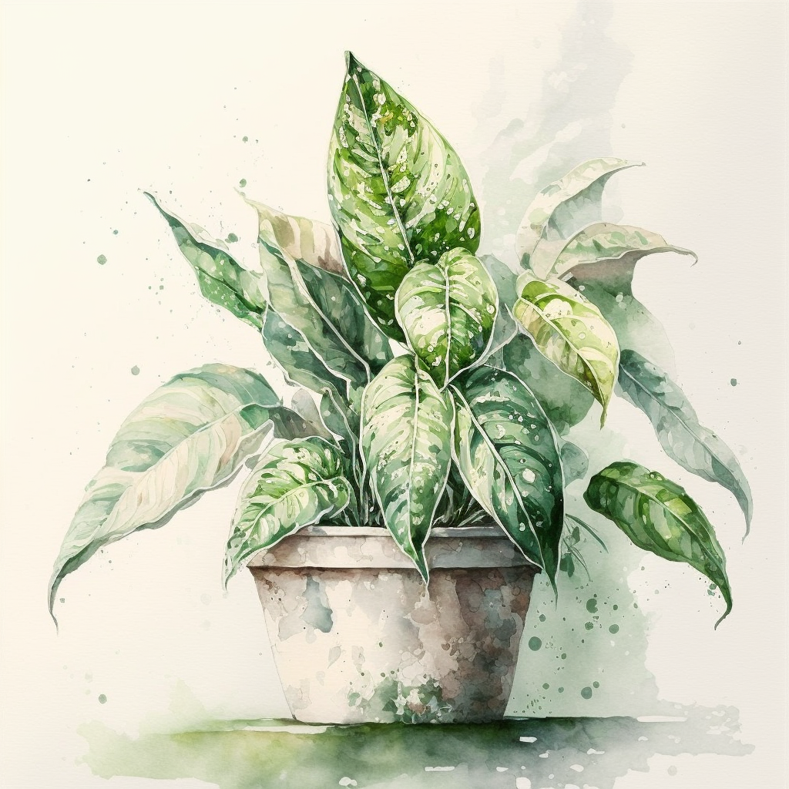
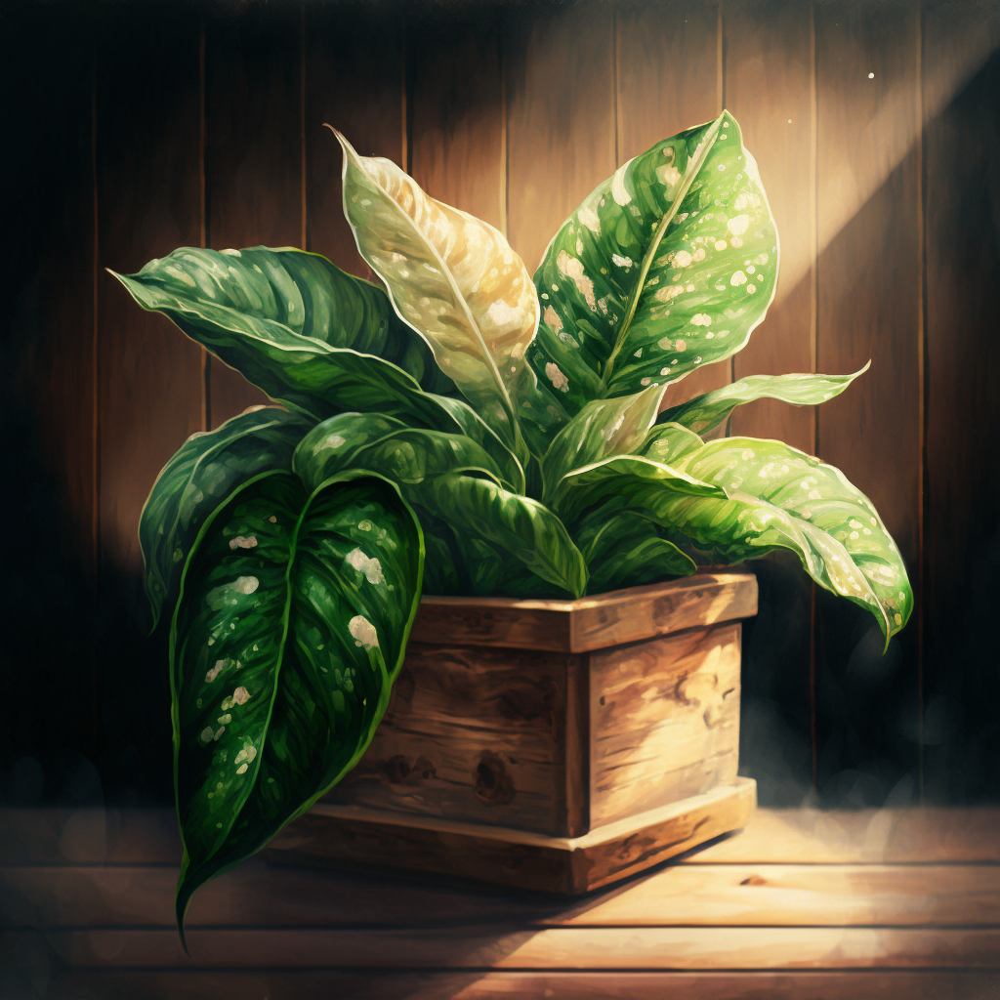

## Introduction

The dieffenbachia seguine, also known as the "dumb cane," is a popular houseplant known for its large, glossy green leaves with white or yellow variegation. Its common name "dumb cane" comes from the plant's ability to cause temporary speechlessness when ingested, as it contains a toxic sap that can cause irritation in the mouth and throat. However, when kept as a houseplant and out of reach of children and pets, it is perfectly safe to have in your home.

Understanding the unique characteristics and care requirements of this variety is important for ensuring its health and beauty in an indoor setting. The Dieffenbachia Seguine is native to the tropical regions of Central and South America, and it thrives in warm, humid environments with bright, indirect light. It can be a great addition to your indoor garden as it can help purify the air and create a lush, tropical atmosphere.

This guide aims to provide a complete understanding of the dieffenbachia seguine, including its characteristics, care requirements, how to distinguish it from other dieffenbachia types and create stunning indoor displays. We will also discuss the plant's history and cultural significance, as well as its potential health benefits.

Before diving into the guide, it's important to note that the dieffenbachia seguine is a slow-growing plant, and it can take several years for it to reach its full potential size. With proper care, however, it can be a beautiful and long-lasting addition to your indoor garden. Additionally, it is important to note that the Dieffenbachia Seguine is toxic if ingested, so it is crucial to keep it out of reach of children and pets.

Whether you're a seasoned plant enthusiast or new to indoor gardening, this guide will provide you with all the information you need to care for and enjoy your dieffenbachia seguine.

## Characteristics of the Dieffenbachia Seguine

#### Description of the Plant's Physical Appearance

The leaves of the dieffenbachia seguine are its most striking feature. They are large, glossy, and typically green in color with white or yellow variegation. The leaves are arranged in a rosette pattern on the stem and can grow up to 2 feet long and 1 foot wide. They have a smooth texture, and their edges are slightly curled.

The stem of the dieffenbachia seguine is thick and sturdy, and can grow up to 3-4 feet tall. It is usually green, but can also be brown or purple depending on the variety. The stem supports the leaves and it is where the plant's roots are anchored.

The dieffenbachia seguine is not known for its flowers, which are small, insignificant and usually hidden by the foliage. The flowers are usually greenish-white or cream-colored and are produced in small clusters on the stem. They are not particularly showy and do not have a strong fragrance.

#### Variations of Color and Patterns

Dieffenbachia seguine comes in various variations of color and patterns. Some varieties have leaves that are entirely green, while others have leaves that are variegated with white or yellow. Some varieties also have leaves that are streaked or mottled with different shades of green. The most popular varieties are the 'Camille', 'Exotica', 'Tropic Snow' and 'Perfection' varieties.

#### Size and Growth Rate

The dieffenbachia seguine is a slow-growing plant, and it can take several years for it to reach its full potential size. However, with proper care and conditions, it can grow up to 3-4 feet tall and 2 feet wide. The plant will grow taller and fuller with time, and it is a good idea to periodically prune and shape it to control its size and shape. In general, the plant will grow slower in lower light conditions and faster in brighter, more optimal conditions.

## Care Requirements

#### Light

The dieffenbachia seguine prefers bright, indirect light. It can tolerate low light conditions, but it will not develop the vibrant colors and patterns of its leaves. Direct sunlight can scorch the leaves and cause leaf burn, so it's best to keep the plant in a spot that gets bright, indirect light for most of the day.

The quality of light is also important for the dieffenbachia seguine. The plant prefers light that is not too harsh, so a spot near a north-facing window or under a sheer curtain is ideal.

#### Water

The dieffenbachia seguine prefers to be kept consistently moist but not waterlogged. Allow the top inch of soil to dry out before watering. In winter, you can reduce watering frequency as the plant goes dormant.

The temperature of the water is also important. Use lukewarm water as cold water can shock the plant.

#### Soil

The dieffenbachia seguine prefers a well-draining, peat moss-based potting mix that has been enriched with organic matter. The pH level should be between 6.0 and 7.0.

#### Fertilizer

Feed your dieffenbachia seguine once a month with a balanced, water-soluble fertilizer during the growing season (spring and summer). You can use a balanced 20-20-20 NPK fertilizer or a fertilizer specifically formulated for indoor plants.

Fertilize the plant once a month during the growing season and once every two months during the dormant season.

#### Temperature and Humidity

The dieffenbachia seguine prefers a warm, humid environment with temperatures between 60°F and 90°F. Ideally, the humidity level should be around 50-60%.

If the humidity is too low, the leaves may turn brown at the edges and the plant may become stunted. If the humidity is too high, the plant may become susceptible to fungal diseases. If the temperature is too low, the plant may become stunted, and if it is too high, the leaves may turn yellow and fall off.

#### Pests and Diseases

The dieffenbachia seguine is generally a hardy plant, but it can be susceptible to pests like spider mites, mealybugs, and scale insects. It can also be affected by fungal diseases if the humidity is too high or if the soil is too wet.

Regularly inspecting the plant for pests and diseases, and keeping the humidity at the proper level, can prevent most issues. If pests or diseases do occur, use an insecticidal soap or neem oil to treat them. If fungal diseases are present, ensure proper drainage and reduce watering.

## Distinguishing Dieffenbachia Seguine from Other Types

#### Comparison to Other Dieffenbachia Varieties

The dieffenbachia seguine is one of several varieties of the dieffenbachia plant. Other varieties include Dieffenbachia amoena, Dieffenbachia picta, and Dieffenbachia maculata. The most notable physical difference between the dieffenbachia seguine and these other varieties is the size and shape of the leaves. The dieffenbachia seguine has large, glossy leaves with a rosette pattern, whereas the other varieties have smaller, more compact leaves.

The care requirements for the dieffenbachia seguine are similar to those of other dieffenbachia varieties. They all prefer bright, indirect light, consistent moisture, and a well-draining, peat moss-based potting mix. However, the dieffenbachia seguine is more tolerant of lower light conditions than some of the other varieties, and it requires less frequent watering.

#### How to Properly Identify a Dieffenbachia Seguine

To properly identify a dieffenbachia seguine, look for large, glossy leaves with white or yellow variegation arranged in a rosette pattern on the stem. The stem should be thick and sturdy and be green in color. The flowers, if present, are small and insignificant.

#### Common Misidentifications

The dieffenbachia seguine is often confused with other dieffenbachia varieties, such as Dieffenbachia amoena, Dieffenbachia picta and Dieffenbachia maculata, which have smaller, more compact leaves. It is also sometimes mistaken for other plants with similar leaf patterns, such as the caladium or the pothos. To avoid confusion, it's important to familiarize yourself with the specific characteristics of the dieffenbachia seguine and compare them to any plants you are considering purchasing.

## Creating Stunning Indoor Displays

#### Placement and Positioning

When creating a stunning indoor display with a dieffenbachia seguine, proper lighting is key. As mentioned earlier, the plant prefers bright, indirect light, so it's best to place it near a north-facing window or under a sheer curtain. Avoid placing it in direct sunlight, as this can scorch the leaves.

The dieffenbachia seguine also looks great when paired with other plants in a tropical-themed display. Consider pairing it with other large-leaved plants such as the monstera, or with ferns, and other indoor plants that thrive in similar conditions.

#### Potting and Repotting

When potting or repotting a dieffenbachia seguine, it's important to choose the right container. The container should have drainage holes to ensure proper drainage, and it should be large enough to accommodate the plant's root system without crowding. A container made of terra cotta or ceramic is a good choice as it allows the soil to dry out quickly and helps prevent root rot.

When repotting, be sure to loosen the roots and gently remove the plant from the old container. Then, place it in the new container, filling the space around the roots with soil. Water the plant well and allow it to drain before placing it in its new location.

#### Pruning and Training

The dieffenbachia seguine should be pruned as needed to control its size and shape. Prune it back by cutting off the top of the stem, just above a node. This will encourage new growth from the base and will make the plant bushier. It is best to prune the plant in the spring or summer, when it is actively growing.

The dieffenbachia seguine can be trained to grow in a certain shape or direction. To shape the plant, prune it to control its size and shape. To train it to grow in a certain direction, gently bend the stem in that direction and secure it with a plant tie.

#### Decorating and Accessorizing

The dieffenbachia seguine can be decoratively paired with natural or man-made elements to enhance its beauty. For example, a woven basket or a handmade pot can accent the plant and add a rustic or modern touch to the display. You can also use natural elements like rocks, shells, or wood to create a naturalistic look.

Combining the dieffenbachia seguine with other plants can create a stunning and diverse indoor display. For example, pairing it with a fern or a calathea can create a lush, tropical look. Or, pairing it with a succulent can create a contrast of textures and forms. Be creative and have fun experimenting with different plant combinations to find the perfect display for your space.

## Conclusion

The dieffenbachia seguine is a beautiful and long-lasting addition to any indoor garden, but it is important to understand its specific care requirements and unique characteristics to ensure its health and beauty. By providing the right amount and quality of light, consistent moisture, proper soil, and regular fertilization, you can create a stunning indoor display that will last for years to come.

With the information provided in this guide, you are now equipped to care for and enjoy your dieffenbachia seguine. Take the time to understand its unique characteristics, provide the right care, and get creative with your indoor displays. Experiment with different combinations of plants, natural and man-made elements, and different placement and positioning to find the perfect display for your space. The dieffenbachia seguine is a versatile and adaptable plant that can be incorporated into many different indoor design styles, so have fun and be creative with it. And don't hesitate to seek help or advice from experts if needed. With proper care and understanding, your dieffenbachia seguine will thrive and bring beauty and greenery to your home for years to come.
