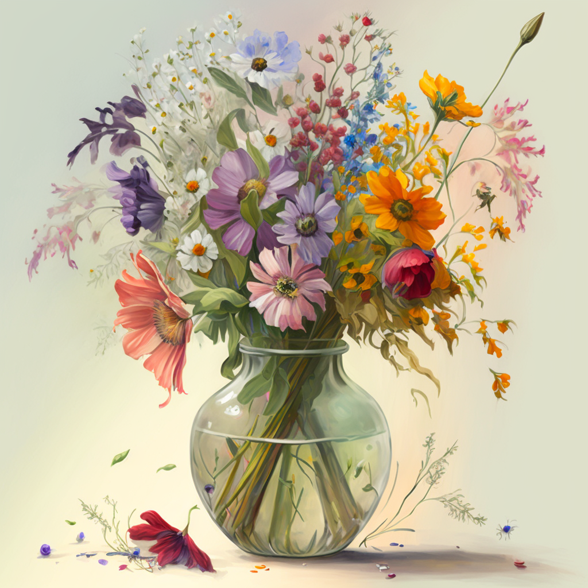

I’ve been a fan of creating my own floral arrangements since I was young. From the moment I first saw my grandma’s beautiful bouquet of roses and carnations, I was hooked! Now, I’m on a mission to help others discover the joys of creating your own DIY flower bouquet.

### Introduction to DIY Flower Bouquets

Creating your own DIY flower bouquet can be an incredibly rewarding experience. Not only will you get the satisfaction of growing something beautiful, but you’ll also be able to customize your bouquet to your own tastes. Whether you’re looking for a classic arrangement of roses and carnations, or something more unique and creative, the possibilities are endless.

If you’ve never tried growing your own flower bouquet before, don’t worry! It’s a lot easier than you might think. With a few basic tools and supplies, you’ll be well on your way to creating a beautiful DIY flower bouquet that you can be proud of.

### Benefits of Growing Your Own Bouquets

Growing your own flower bouquet offers a number of benefits. First, it’s much more affordable than buying pre-made bouquets from a florist. You’ll also be able to customize your bouquet to your exact preferences. Whether you want a traditional arrangement of roses and carnations, or something more unique and creative, the possibilities are endless.

Another great benefit of growing your own flower bouquet is that you can be sure that the flowers are fresh. When you buy from a florist, the flowers may have been sitting in a refrigerated case for days or even weeks. By growing your own, you’ll know that the flowers are as fresh as can be.

Finally, growing your own flower bouquet can be a great way to relax and de-stress. You’ll be able to take your time and enjoy the process of creating something beautiful. Plus, you’ll get the satisfaction of seeing it come to life!

### Benefits of Growing Your Own Bouquets

Before you start growing your own flower bouquet, it’s important to have the right tools and supplies. Here’s a list of the essentials:

- [Flower pots or containers](https://amzn.to/3QE7hog)
- Soil
- [Fertilizer](https://amzn.to/3Gyq8wb)
- Watering can
- [Pruning shears](https://amzn.to/3Gyq8wb)
- Floral tape
- Floral wire
- Floral foam

Once you have all of these supplies, you’ll be ready to start growing your own DIY flower bouquet!

### Choosing the Right Flowers for Your Bouquet

When it comes to choosing the right flowers for your DIY flower bouquet, it’s important to think about the colors, shapes, and textures that you want. Do you want a classic arrangement of roses and carnations, or something more unique and creative? Do you want a muted color palette, or something more vibrant?

The best way to get started is to visit your local nursery or garden center and take a look at the different types of flowers they have. You can also search online for flower varieties that suit your preferences. Keep in mind that some flowers are easier to grow than others, so it’s important to do your research before you buy.

### Tips for Growing a Beautiful Bouquet

Once you’ve chosen the right flowers for your DIY flower bouquet, it’s time to start growing! Here are a few tips to help you get the best results:

- Plant your flowers in well-drained soil and in a sunny location.
- Fertilize your plants regularly to ensure they get the nutrients they need.
- Water your plants regularly so that they don’t dry out.
- Prune and deadhead your flowers regularly to keep them looking their best.
- Keep an eye out for pests and diseases and take action if necessary.

### Fun Ideas for Making a Unique Bouquet

If you’re looking for something a little bit different, why not try making a unique DIY flower bouquet? Here are a few fun ideas to get you started:

- Try combining different colors and textures for a unique look.
- Add in some greenery or foliage for an added touch of texture.
- Use bright colors for a cheerful and vibrant look.
- Add in some fruits or vegetables for a unique twist.
- Use ribbons and other embellishments for a one-of-a-kind bouquet.

### Different Arrangement Styles for Your DIY Bouquet

When it comes to arranging your DIY flower bouquet, there are a few different styles to choose from. You can opt for a traditional, symmetrical arrangement, or something more modern and asymmetrical. Here are a few of the most popular arrangement styles:

- The Cascade: This is a classic bouquet style that features a waterfall effect.
- The Hand-Tied: This style features a bundle of flowers that are tied together with ribbon or twine.
- The Posy: This is a smaller bouquet that is perfect for special occasions.
- The Nosegay: This style is similar to the posy, but with more added foliage.

### Caring for Your Bouquet After Harvesting

Once you’ve harvested your DIY flower bouquet, it’s important to take care of it properly. Here are a few tips to help you keep your bouquet looking its best:

- Place your bouquet in a vase of fresh, clean water.
- Change the water every day to keep your flowers fresh.
- Trim the stems every few days to ensure they stay hydrated.
- Add a few drops of sugar or lemon juice to the water to help your flowers last longer.
- Keep your bouquet away from direct sunlight and heat.

### Creative Ways to Display Your Bouquets

Once you’ve created your DIY flower bouquet, it’s time to show it off! Here are a few creative ways to display your bouquet:

- Hang your bouquet on a wall or a door with a ribbon.
- Place your bouquet in a beautiful vase and display it on your dining table or mantle.
- Create a centerpiece by arranging your bouquet in a shallow bowl.
- Make a bouquet of dried flowers and display it in a shadow box.
- Place your bouquet in a terrarium or a glass jar to give it a unique look.

### Conclusion

Creating your own DIY flower bouquet can be a lot of fun. Not only will you get the satisfaction of growing something beautiful, but you’ll also have the freedom to customize it to your own tastes. With a few essential tools and supplies, and a little bit of know-how, you’ll be well on your way to creating a stunning bouquet that you can be proud of. So, what are you waiting for? Get started on your own DIY flower bouquet today and start your exciting journey to creating something beautiful!

Shop now for all the tools and supplies you need to get started on your DIY flower bouquet. From pots and soil to fertilizers and pruning shears, you’ll find everything you need to create a beautiful bouquet that you can be proud of.