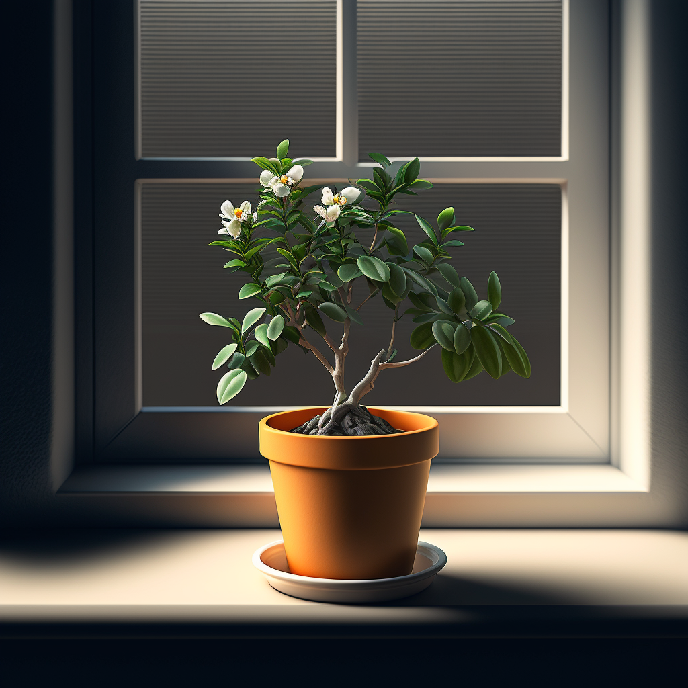
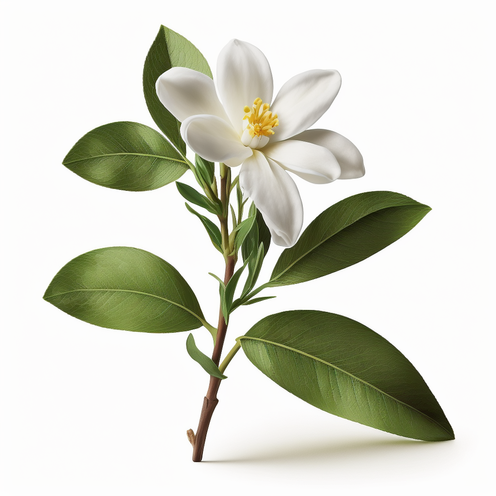
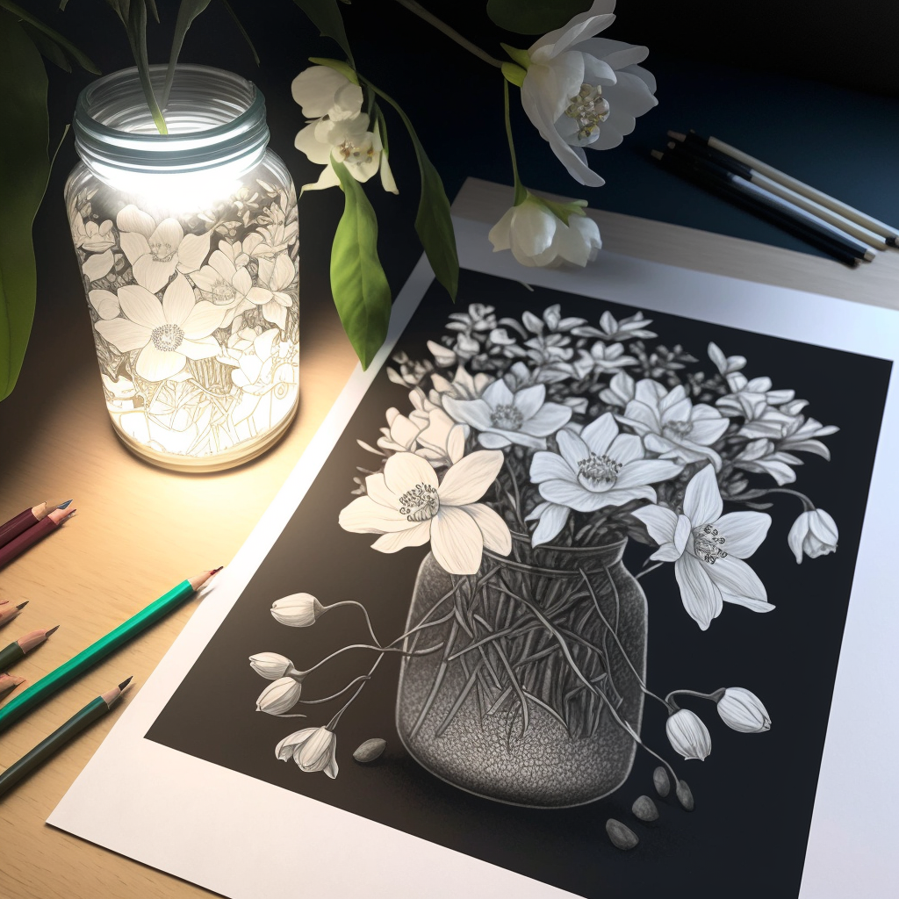
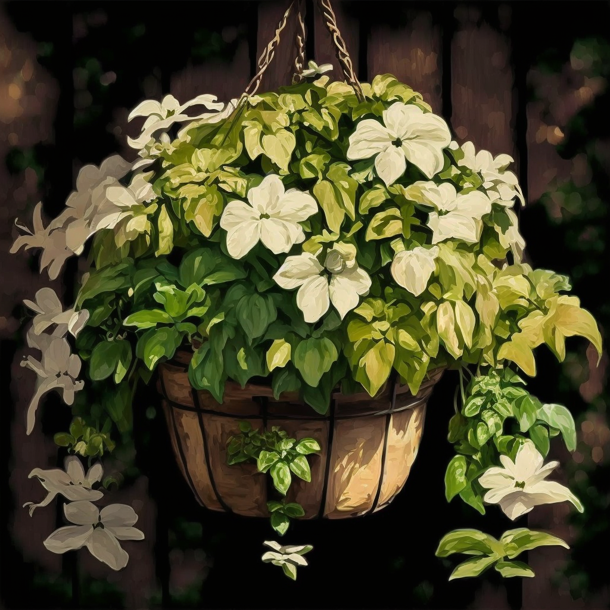
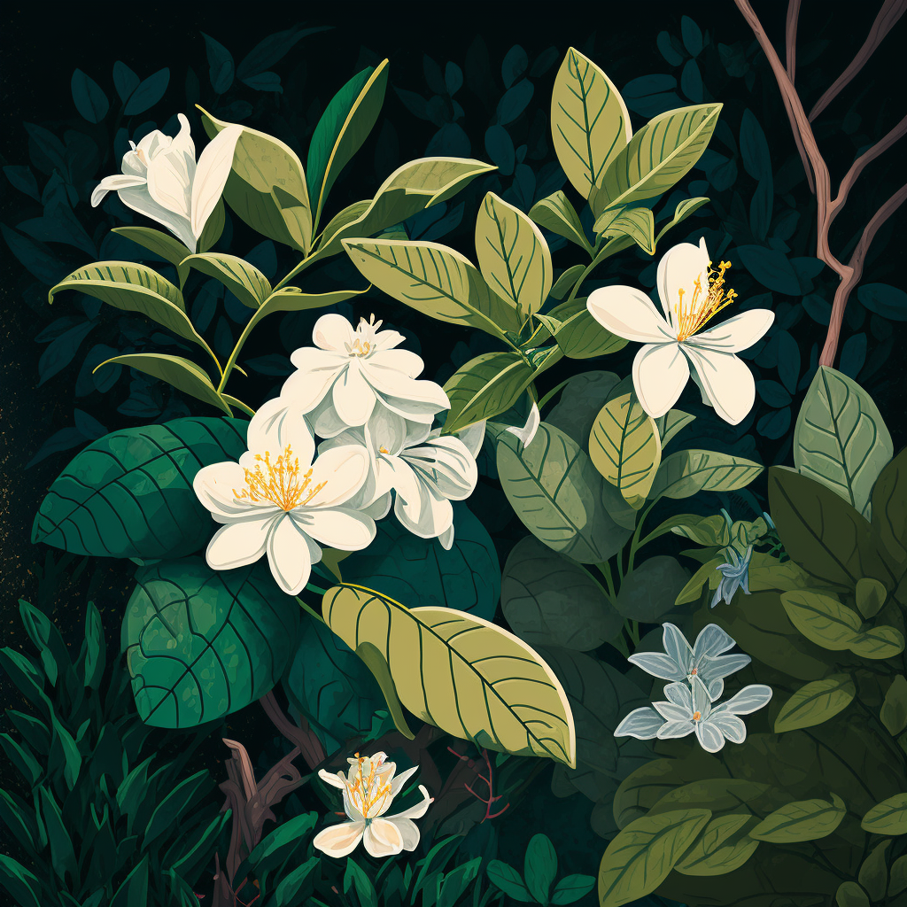
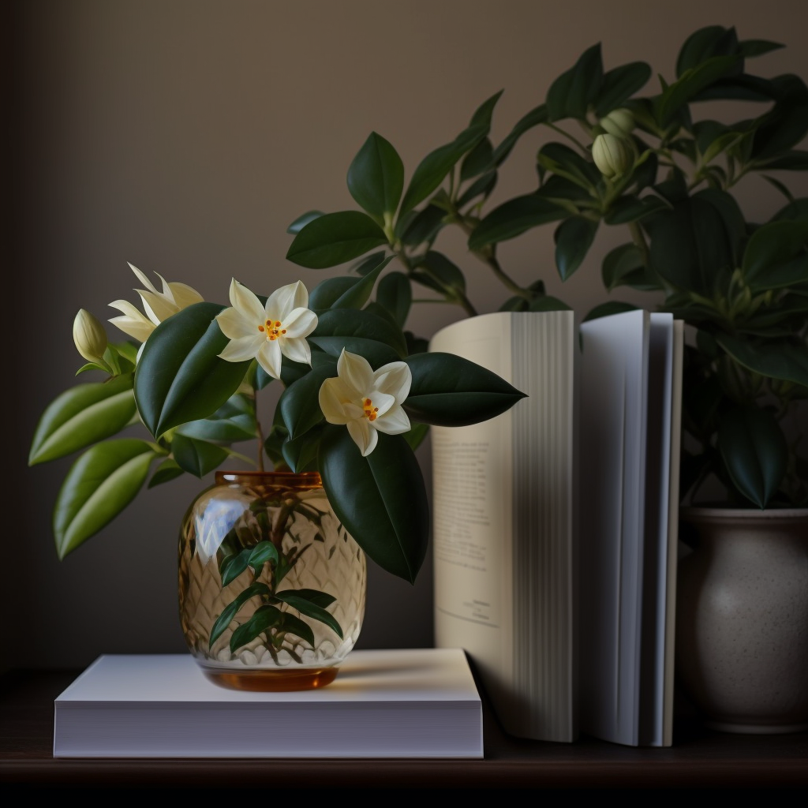

## Introduction

Jasmine plants are known for their beautiful and fragrant flowers, making them a popular choice for indoor gardening. These plants come in a variety of shapes, sizes and colors, and can be trained to grow in different forms, making them a versatile addition to any home. The sweet, heady scent of jasmine flowers is often used in perfumes, teas and other products and it can have a relaxing and calming effect on the mind and body.

Jasmine plants are native to tropical and subtropical regions of the world, and they come in a variety of species. Some species, like Jasminum sambac, can be grown indoors as houseplants, while others, like Jasminum officinale, are more suited to outdoor cultivation.

In addition to their aesthetic appeal, jasmine plants also offer a number of benefits to the home. One of the most notable benefits of jasmine plants is their ability to purify the air. These plants have been shown to remove pollutants and harmful chemicals from the air, making them a great choice for indoor gardening. They also have a relaxing and calming effect, making them an ideal choice for bedrooms and other relaxing spaces. The sweet, heady scent of jasmine flowers is often used in perfumes, teas and other products and it can have a relaxing and calming effect on the mind and body.

Another benefit of jasmine plants is that they are relatively low maintenance. These plants require minimal care and can be grown indoors or outdoors in a variety of climates. They do not require a lot of attention and can thrive with minimal watering and sunlight. Furthermore, jasmine plants are relatively hardy and can withstand slight neglect, making them a great option for people who may not have the time or resources to devote to more demanding houseplants.

The purpose of this article is to provide information on how to care for and maintain jasmine plants. We will cover topics such as light and temperature requirements, watering and humidity, soil and fertilizer, pruning and training, and common problems and solutions. By the end of this article, readers will have a better understanding of how to care for and maintain their jasmine plants, allowing them to enjoy the beauty and benefits of these plants for years to come.

## Types of Jasmine Plants

There are many different types of jasmine plants available, each with their own unique characteristics. Some popular varieties include Jasminum polyanthum, Jasminum sambac, and Jasminum officinale.

Jasminum polyanthum, also known as pink jasmine or many-flowered jasmine, is a twining vine with delicate pink flowers. This variety can be trained to climb or grown as a trailing plant. It is a hardy plant and can tolerate low light conditions. It's a great option for indoor spaces that have low light.

Jasminum sambac, also known as Arabian jasmine or mogra, is a shrub or vine with larger and more fragrant white flowers. This variety is often used in perfumes and is known for its sweet, heady scent. This variety is a great option for indoor spaces where the fragrance can be appreciated such as living rooms, bedrooms or bathrooms.

Jasminum officinale, also known as true jasmine or common jasmine, is a twining vine with white flowers. This variety is often used in teas and has a more subtle fragrance compared to other varieties. It is tolerant of low light and cooler temperatures, making it a great option for indoor spaces where the temperature may fluctuate.

When it comes to selecting a jasmine plant for your home, it's important to consider the size, shape, and color of the flowers. Some varieties have larger, more fragrant flowers, while others have smaller, more delicate flowers. In addition, some varieties are better suited to indoor spaces, while others are better suited to outdoor spaces.

When comparing the different varieties in terms of size, shape, and color of flowers, it is important to consider the space you have available. For example, if you have a small space, a smaller variety such as Jasminum polyanthum may be more suitable than a larger variety such as Jasminum sambac. Similarly, if you want to add fragrance to your home, a variety with a stronger scent such as Jasminum sambac may be a better option than a variety with a more subtle scent such as Jasminum officinale.

In terms of the best type of jasmine plant for different types of indoor spaces, Jasminum polyanthum is a great option for low light spaces, Jasminum sambac is a great option for spaces where fragrance can be appreciated and Jasminum officinale is a great option for spaces where the temperature may fluctuate.

## Light and Temperature Requirements

Jasmine plants require bright, indirect light to thrive. They can tolerate some direct sunlight, but it's important to protect them from harsh, direct sunlight which can scorch their leaves. An east or west-facing window is a great option for jasmine plants, as they will receive bright, indirect light throughout the day. If your indoor space does not have enough natural light, you can supplement with grow lights.

To provide the correct amount of light for a jasmine plant, it's important to pay attention to the leaves. If the leaves are yellow or pale, it may be a sign that the plant is not receiving enough light. On the other hand, if the leaves are dark green and glossy, it may be a sign that the plant is receiving too much light. It's important to find a balance, as too much or too little light can be harmful to the plant.

The ideal temperature range for jasmine plants is between 60 and 75 degrees Fahrenheit (16 and 24 degrees Celsius). Jasmine plants are sensitive to extreme temperature changes and should be kept away from drafty areas and air conditioning vents. They prefer moderate temperatures and will not tolerate temperatures below 50 degrees Fahrenheit (10 degrees Celsius) or above 80 degrees Fahrenheit (27 degrees Celsius).

To maintain the correct temperature for a jasmine plant, it's important to monitor the temperature in the room where the plant is located. If the temperature drops below 60 degrees Fahrenheit (16 degrees Celsius), it may be necessary to move the plant to a warmer location. On the other hand, if the temperature rises above 75 degrees Fahrenheit (24 degrees Celsius), it may be necessary to move the plant to a cooler location. It's also important to protect the plant from any drafty areas or air conditioning vents.

## Water and Humidity

Jasmine plants require regular watering to thrive, but it is important to not over-water or under-water them. The ideal watering schedule for jasmine plants varies depending on the humidity and temperature levels of the room, the size of the pot and the stage of growth of the plant. In general, jasmine plants should be watered when the top inch of soil is dry to the touch.

To determine when a jasmine plant needs water, you can stick your finger in the soil or use a moisture meter. If the soil feels dry, it's time to water the plant. If the soil feels damp, it's best to wait a few days before watering again. Over-watering can lead to root rot and under-watering can cause the leaves to turn yellow and drop off.

Jasmine plants prefer a humidity level of 50-60%. Low humidity can cause the leaves to become dry and brittle. To increase humidity, you can place a tray of water near the plant, use a humidifier or mist the leaves regularly.

When watering jasmine plants, it's best to use lukewarm water. Cold water can shock the roots and cause damage. You can water the plant by using a watering can or by immersing the pot in a bucket of water. It's important to make sure that the water is able to reach the roots of the plant and that the soil is saturated. After watering, it's important to remove any excess water from the tray or saucer underneath the pot to prevent root rot.

## Soil and Fertilizer

Jasmine plants prefer well-draining, slightly acidic soil with a pH between 5.5 and 7.0. A good quality, all-purpose potting mix or a mix of equal parts peat moss, perlite and vermiculite works well. It's important to make sure that the soil is not too heavy, as this can lead to waterlogging and root rot.

When it comes to repotting a jasmine plant, it's best to do so in the spring, before the growing season begins. To repot a jasmine plant, gently remove it from its current pot, shake off any excess soil and prune any roots that appear to be dead or damaged. Then, place the plant in a new pot that is slightly larger than the previous one and fill in with fresh potting mix. Be sure to water the plant well after repotting to help the roots settle in.

Jasmine plants should be fertilized regularly during the growing season to ensure optimal growth. A balanced, water-soluble fertilizer is the best option for jasmine plants. It's important to follow the instructions on the fertilizer package, as over-fertilizing can lead to leaf burn and other issues.

When fertilizing a jasmine plant, it's best to do so every four to six weeks during the growing season. The fertilizer can be applied directly to the soil, or it can be added to the water when watering the plant. It's important to avoid fertilizing during the dormant period, as this can lead to weak growth and other issues.

## Pruning and Training

Pruning is an important aspect of caring for jasmine plants, as it helps to promote healthy growth and encourage the production of more flowers. The best time to prune a jasmine plant is in the late winter or early spring, before new growth begins.

When pruning a jasmine plant, it's important to remove any dead, diseased or damaged wood first. Then, remove any branches that are growing inward or crossing over each other, as this can lead to weak growth and disease. It's also important to remove any branches that are growing too long, as this can lead to an overgrown, leggy plant.

When pruning, it's important to use sharp, clean pruning shears to make clean cuts. Avoid tearing or crushing the branches, as this can lead to disease. Additionally, it's important to sanitize the pruning shears before and after use to prevent the spread of disease.

Training a jasmine plant to grow in a certain direction is a great way to control its shape and size. Jasmine plants can be trained to grow as a vine or as a shrub, depending on the desired look. To train a jasmine plant to grow as a vine, simply tie the stem to a support, such as a trellis or a wire. As the stem grows, it will naturally cling to the support. To train a jasmine plant to grow as a shrub, simply pinch back the tips of the stem to encourage bushy growth.

Shaping a jasmine plant for a desired look is an easy process. Simply pinch back the tips of the stem to encourage bushy growth. Additionally, you can prune the plant to control its size and shape. It's important to avoid pruning too much or too aggressively, as this can lead to weak growth and disease.

## Common Problems and Solutions

Jasmine plants are generally hardy and easy to care for, but like all plants, they can experience problems from time to time. Some common problems that can occur with jasmine plants include:

- Yellow leaves: This can be caused by a lack of light or over-watering. To solve this problem, make sure the plant is receiving enough light and adjust the watering schedule.

- Brown leaves: This can be caused by too much direct sunlight or over-fertilizing. To solve this problem, move the plant to a location with less direct sunlight and adjust the fertilizing schedule.

- Wilting leaves: This can be caused by under-watering or a lack of humidity. To solve this problem, increase the frequency of watering and make sure the humidity level is at least 50%.

- Slow growth: This can be caused by a lack of light, poor soil or lack of fertilizer. To solve this problem, make sure the plant is receiving enough light, use a high-quality soil and fertilize the plant regularly.

- Pests: Common pests that can affect jasmine plants include spider mites, whiteflies and scale insects. To solve this problem, use a pesticide or insecticide specifically designed for jasmine plants.

To identify and diagnose problems with jasmine plants, it's important to pay attention to the leaves and overall appearance of the plant. Yellow or brown leaves, wilting leaves, slow growth or the presence of pests are all signs that something may be wrong.

To prevent future problems with jasmine plants, it's important to provide the plant with the proper care and conditions. This includes providing the plant with enough light, water, and fertilizer, maintaining the correct temperature and humidity levels, and keeping an eye out for pests. Additionally, regularly inspecting the plant for signs of problems can help prevent them from becoming too serious.

## Conclusion

In conclusion, jasmine plants are a beautiful and fragrant addition to any home. Throughout this article, we've covered the various aspects of caring for and maintaining jasmine plants, including the types of jasmine plants available, the light and temperature requirements, watering and humidity, soil and fertilizer, pruning and training, and common problems and solutions. We've emphasized the importance of providing the correct care and conditions for a jasmine plant to thrive and encouraged readers to be aware of common problems that can occur with jasmine plants, so they can take steps to prevent them.

One of the main benefits of having a jasmine houseplant in the home is that it can add beauty and fragrance to any room. Jasmine plants have a soothing and relaxing fragrance that can help to reduce stress and improve air quality. Additionally, jasmine plants are easy to care for, making it a great option for both experienced gardeners and first-time plant owners.

In light of the benefits that jasmine plants can bring to a home, we encourage readers to try growing a jasmine plant in their own home. Whether you're an experienced gardener or a first-time plant owner, a jasmine plant is a great choice for adding a touch of nature to your home. By following the tips outlined in this article, you can ensure that your jasmine plant will remain healthy and beautiful for many years to come.
