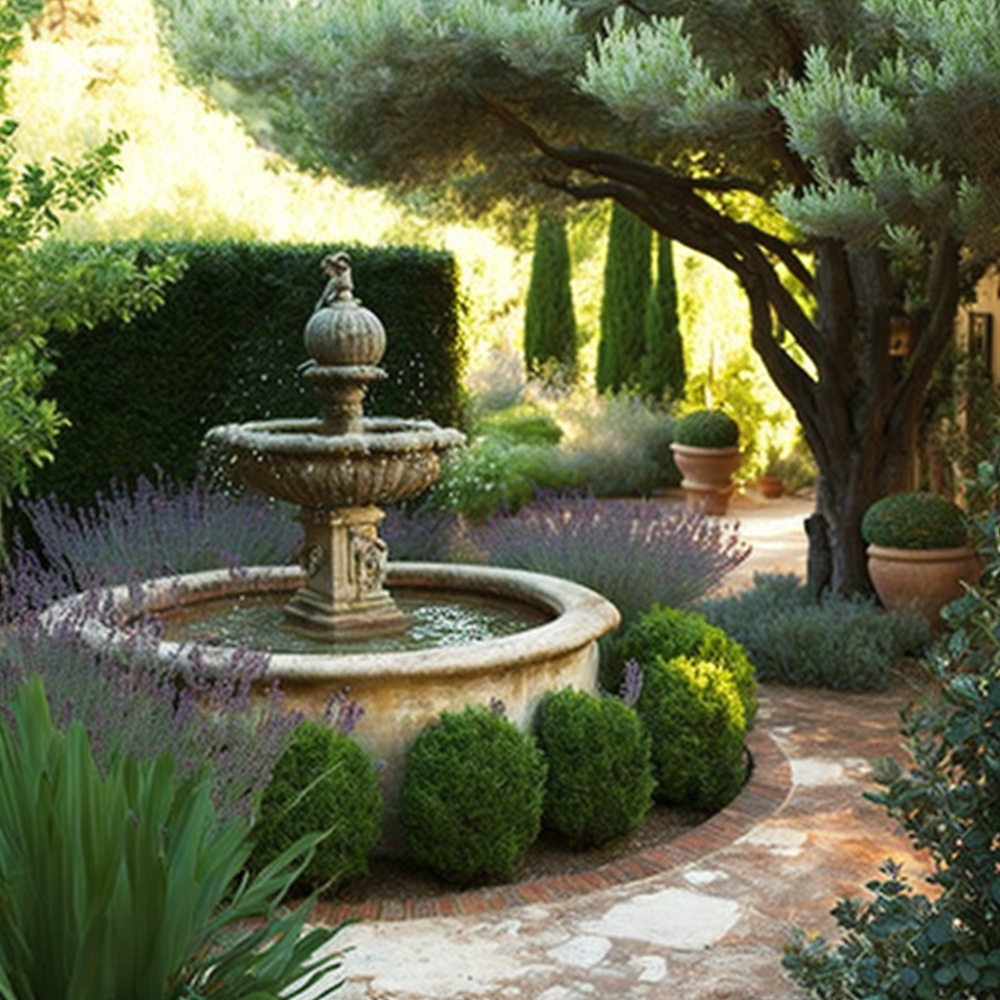
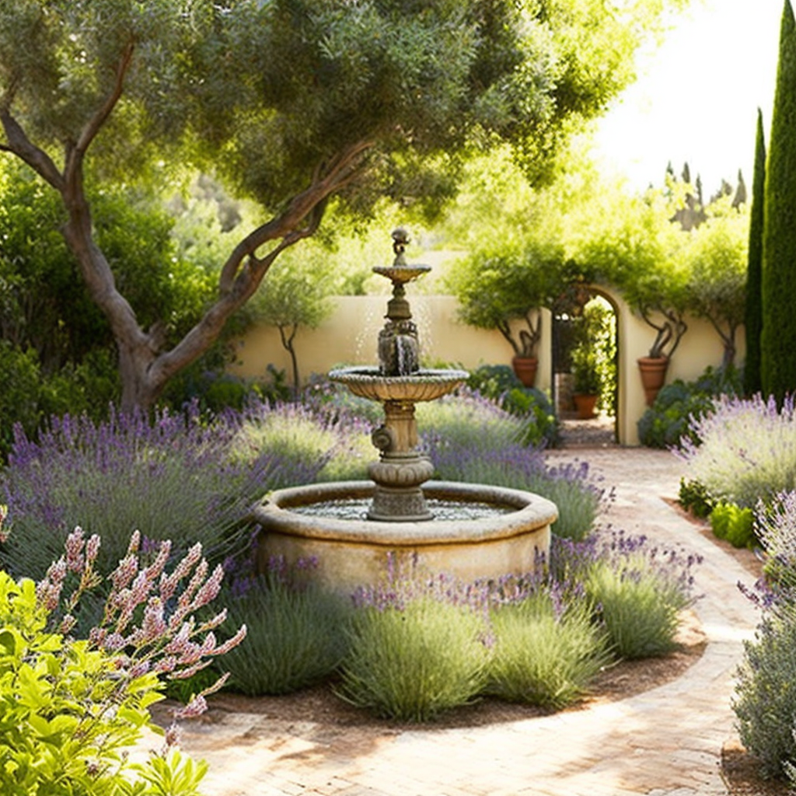

## Introduction

#### Definition

A Mediterranean-style garden is characterized by its use of native plants, warm colors, and a relaxed, informal design inspired by the landscapes of Mediterranean countries such as Spain, Italy, and Greece. These gardens often feature terracotta pots, stone pavers, and rustic elements such as wrought iron gates and arbors.

#### Benefits

Mediterranean-style gardens are ideal for warm climates and require minimal maintenance. The use of native plants means they require less watering and are able to thrive in the local environment. Additionally, these gardens can serve as an extension of the home, providing an inviting outdoor space for entertaining and relaxation.

## Designing a Mediterranean-style Garden

#### Consider the Climate

Mediterranean-style gardens are well-suited to warm climates with mild winters. However, even if you don't live in a Mediterranean climate, you can still incorporate elements of this style into your garden by choosing plants that can tolerate your local climate and weather conditions.

#### Choose Your Plants

When choosing plants for a Mediterranean-style garden, select ones that are native to the Mediterranean region such as olive trees, lavender, rosemary, sage, and thyme. These plants are drought-tolerant, require minimal maintenance, and provide a fragrant and colorful backdrop to the garden. Also consider adding succulents, cactus and other drought-resistant plants that can tolerate dry and hot climates.

It is also important to pay attention to the specific microclimate of the garden. If there are some shaded or moister areas, that can give you opportunity to have a diversity of plants, for example ferns, or other shade-tolerant plants.

## Planting a Mediterranean-style Garden

#### Plant Selection

When selecting plants for a Mediterranean-style garden, look for drought-tolerant varieties that can thrive in warm climates. Some popular options include olive trees, lavender, rosemary, sage, thyme, succulents, cactus and other drought-resistant plants. Choose plants with a variety of textures and colors to create visual interest.

#### Arrangement of Plants

In a Mediterranean-style garden, plants are often arranged in a natural, informal way. Instead of neat rows, plants are grouped together to create a lush and relaxed landscape. Consider using a combination of large shrubs and trees, small herbs, and ground covers to create depth and dimension. Use terracotta pots and urns to add a rustic touch, and mix different kinds of pottery in the garden for a unique touch.

Also, consider the use of trellis and other supports for vining plants like ivy, grapes, or bougainvillea. This will add an extra dimension to the garden and can be very attractive.

## Patios and Walkways

#### Create Walkways

Walkways are an important element in a Mediterranean-style garden, as they provide a way to navigate through the space and define different areas of the garden. Use natural stone pavers or cobblestones to create a rustic and authentic look. Consider incorporating curves and winding paths to add interest and a sense of movement through the garden.

#### Construct a Patio

A patio is a great place to relax and entertain in a Mediterranean-style garden. Use the same materials used for the walkways, such as natural stone pavers or cobblestones, to create a cohesive look. For a traditional Mediterranean touch, consider incorporating a pergola or trellis overhead for some shade and a place for climbing plants.

When designing the patio, consider how it will be used and how much space you will need for furniture and other elements. Think also about integrating an outdoor kitchen or a fireplace for more versatility in the use of the space.

## Water Features

#### Water Fountains

Water features are a popular addition to Mediterranean-style gardens, and a fountain can provide both the soothing sound of running water and a focal point for the garden. Consider a traditional tiered fountain made of stone or terracotta for a classic Mediterranean look, or a simple wall-mounted fountain for a more modern feel.

#### Ponds and Streams

Ponds and streams can add a natural element to a Mediterranean-style garden and can serve as a habitat for fish and aquatic plants. They can also be designed to blend seamlessly into the landscape and complement the overall design of the garden.

When incorporating a water feature, think about the maintenance required and choose a feature that is relatively low maintenance and easy to clean. Also, consider the sound, the visual impact and how it can be incorporated into the overall design of the garden.

## Structures

#### Gazebos

A gazebo is a freestanding structure that can provide a shaded area for relaxing or entertaining in a Mediterranean-style garden. Traditional gazebos are made of wood and feature a peaked roof, while more modern gazebos may be made of metal or other materials. Consider adding a comfortable seating area and some potted plants to create a cozy retreat.

#### Arbors and Pergolas

An arbor or pergola is a great way to add vertical interest to a Mediterranean-style garden and can serve as a support for climbing plants. These structures can be made of wood, metal, or other materials and can be used to define different areas of the garden or to create a shaded seating area. Consider incorporating a swing or hanging a hammock for added relaxation.

When designing the structure, take into consideration the size and the style, and how it will complement the overall design of the garden. Think about the materials and colors that will be used, and whether the structure should be painted or left natural.

## Furnishings

#### Benches

Benches are a great addition to a Mediterranean-style garden, providing a place to sit and enjoy the surroundings. Consider using a bench made of natural materials such as wood or stone for a rustic feel. Iron benches with ornate designs are also fitting for this style and will add a touch of elegance.

#### Tables and Chairs

Outdoor dining tables and chairs are an essential element for a Mediterranean-style garden and can be used for entertaining or for enjoying a meal outside. Select sturdy pieces made of materials that are suitable for the outdoors such as wrought iron, teak, or durable plastic. Traditional Mediterranean style tables and chairs are often made of wood with intricate designs. Mix and match different styles and materials to create a unique look.

When selecting furniture, think about comfort and also what kind of activities will take place, whether it's just lounging or dining. And also consider the size and how it will fit in the area allocated for it.

## Accessories

#### Statues and Ornaments

Statues and other decorative elements can add a sense of history and charm to a Mediterranean-style garden. Consider using traditional elements such as urns, statues of Greek or Roman gods and goddesses, or even a sundial to give an authentic feel.

#### Lighting

Lighting is a critical component of a Mediterranean-style garden and can help to create a warm and inviting atmosphere during the evening hours. Select lighting fixtures that are suitable for outdoor use and that complement the overall design of the garden. String lights, lanterns, and candles are all great options. Solar lights or low-voltage lighting is also a good option because they're energy-efficient and easy to install.

When planning lighting, consider the safety and the ambiance that you want to create. Think about how it will look both during the day and night. Also, take into account how to light up the main features of the garden such as a fountain or a statue.

## Conclusion

A Mediterranean-style garden is characterized by its use of native plants, warm colors, and a relaxed, informal design. These gardens are ideal for warm climates and require minimal maintenance. They provide an inviting outdoor space for entertaining and relaxation, and the use of natural materials such as stone, terracotta and wood gives a rustic and authentic feel.

When designing a Mediterranean-style garden, pay attention to the climate, consider the use of native plants, and choose elements that complement the overall design. Be sure to also include a variety of textures and colors to create visual interest, and incorporate comfortable seating, dining and other functional areas. Finally, think about the ambiance that you want to create and use lighting and accessories to highlight important features of the garden. Remember, a Mediterranean garden is a place where you can enjoy the warm weather, relax and entertain, so make sure you design a garden that fits your needs and preferences.
