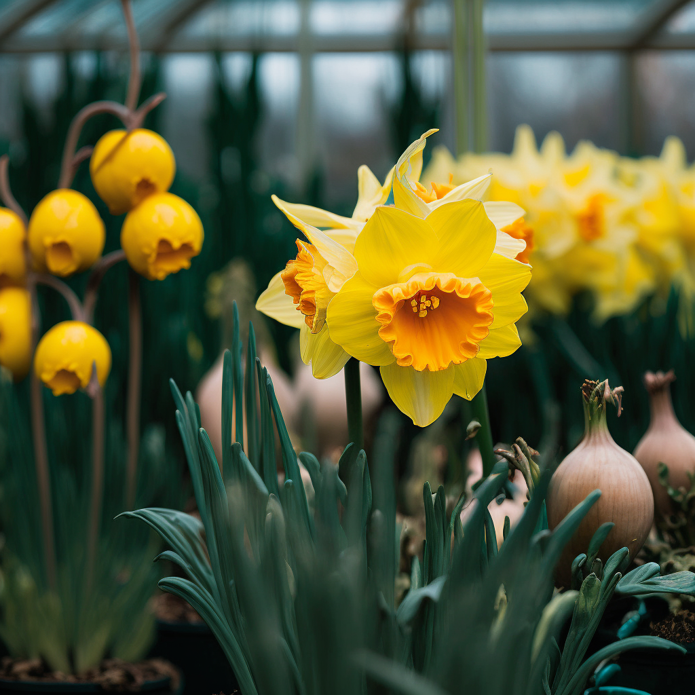
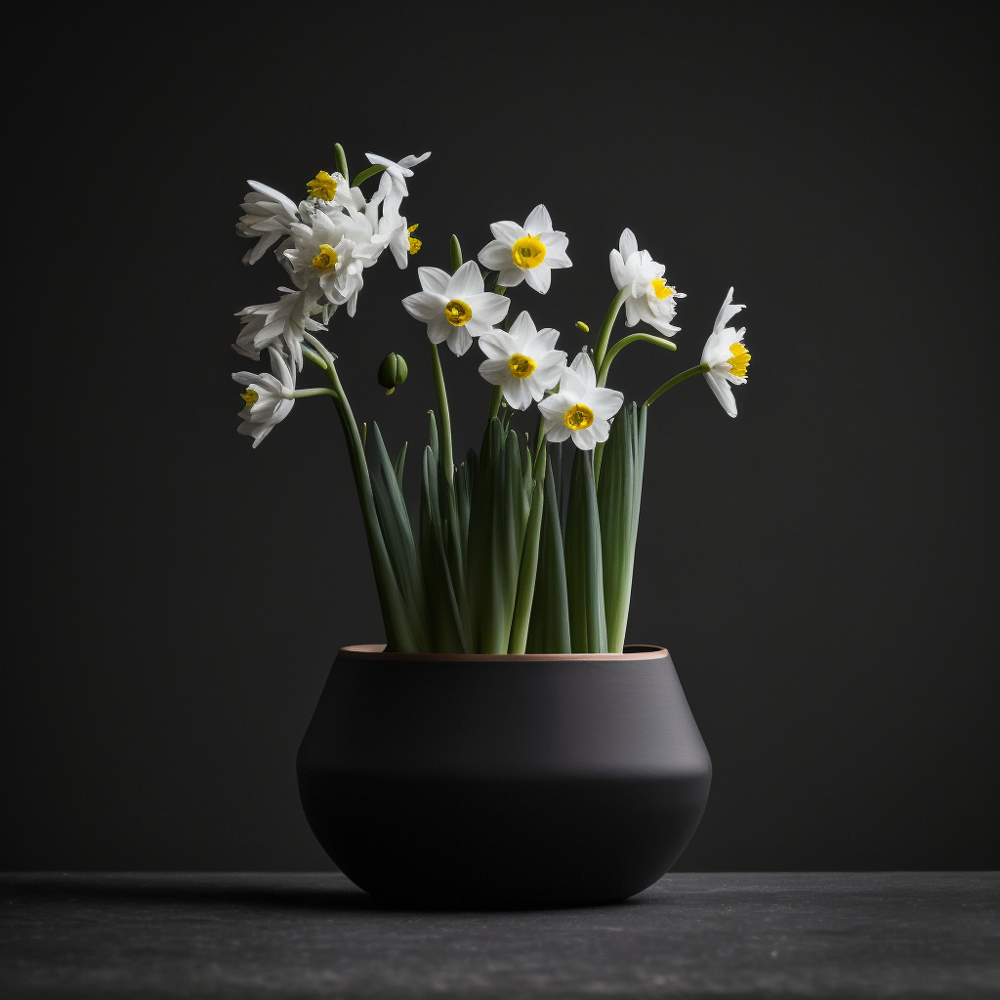
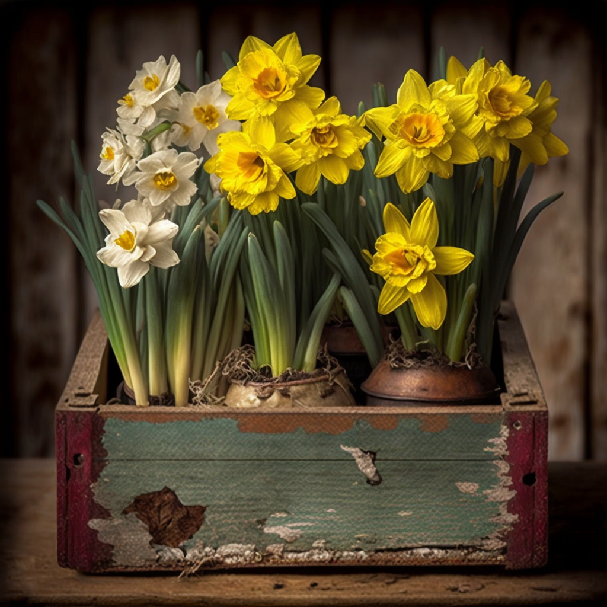
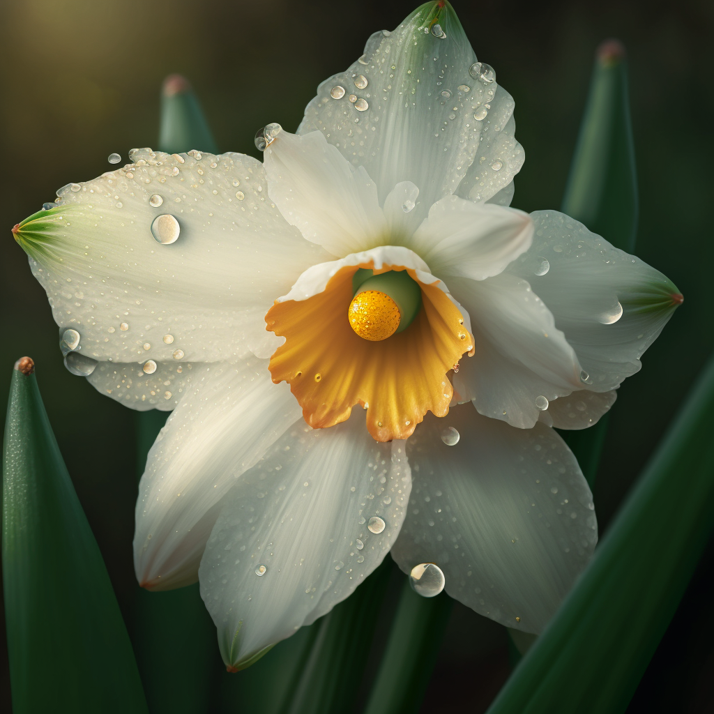
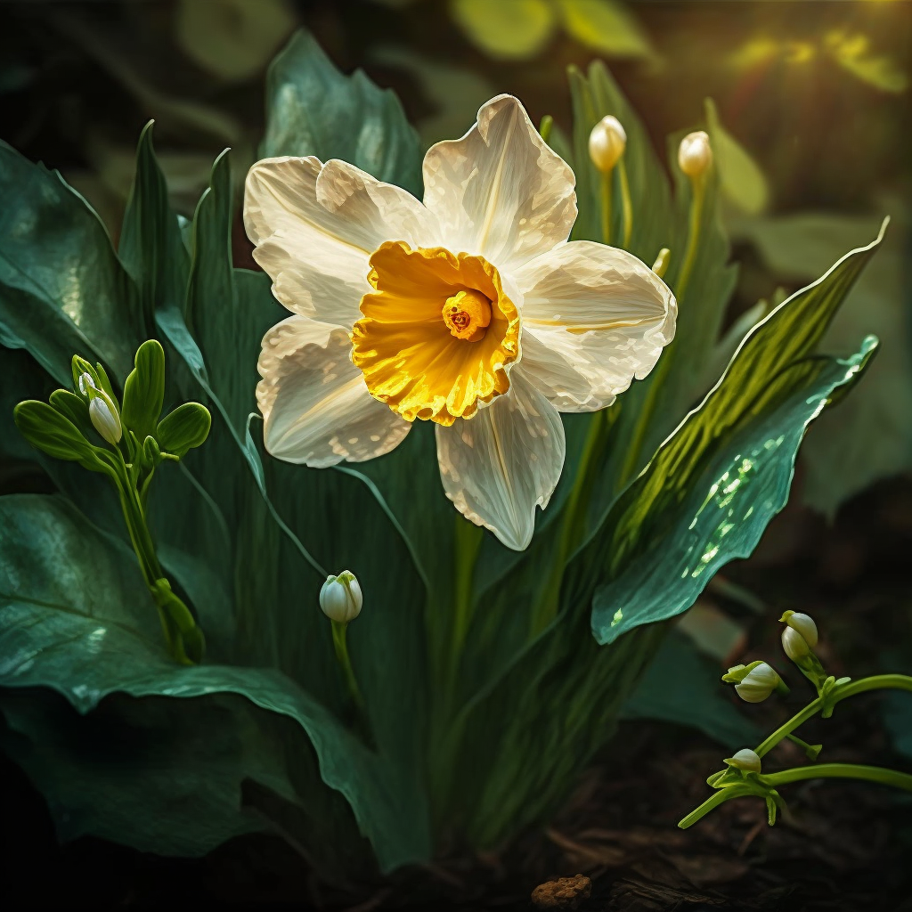
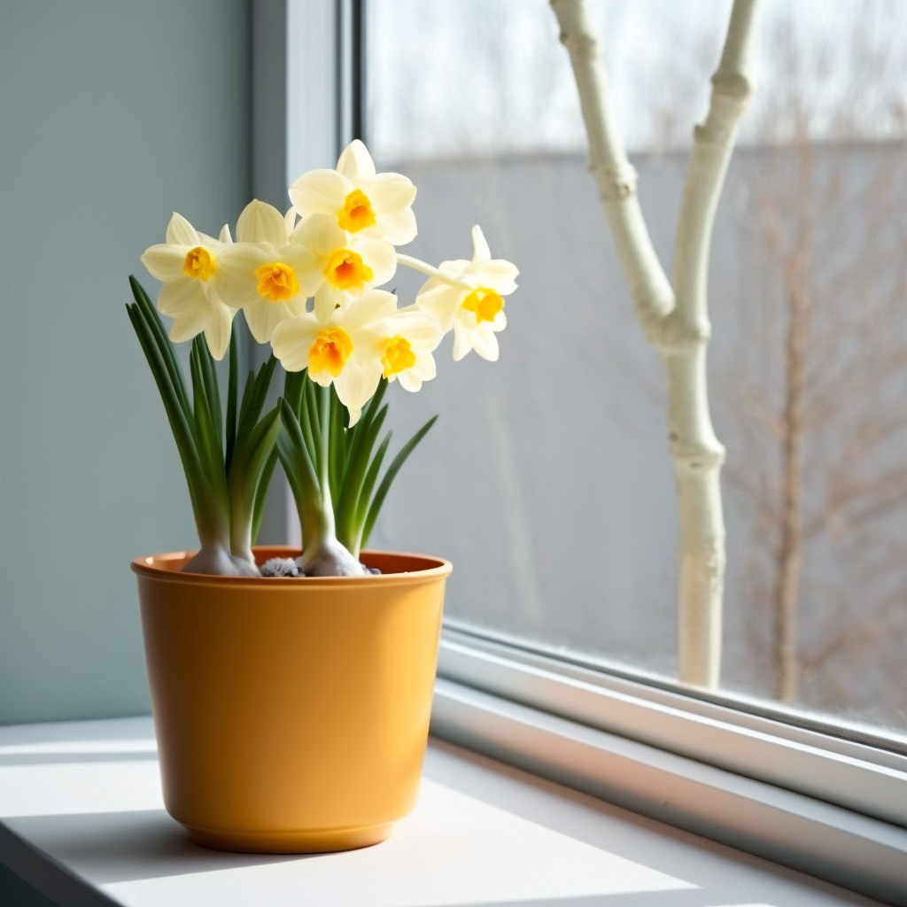

## Introduction

The Narcissus plant, also known as the daffodil, is a perennial flowering plant that belongs to the Amaryllidaceae family. These plants are commonly known for their bright yellow or white flowers that bloom in the spring. They are native to Europe and Asia but are now widely cultivated in many parts of the world. Narcissus plants are hardy, easy to grow, and require minimal care, making them a popular choice for gardens and indoor spaces.

Proper care is essential for the Narcissus plant to thrive and produce beautiful blooms. The plant requires specific conditions such as proper lighting, temperature, soil, drainage, and watering to grow healthy and strong. Failure to provide these conditions can result in stunted growth, poor blooming, or even plant death. Understanding the basic care requirements of the Narcissus plant is crucial for its survival and success in any setting.

This article will provide a comprehensive guide to the care and maintenance of the Narcissus plant. It will cover basic care requirements, including lighting and temperature, soil and drainage, watering, and fertilizer. Additionally, it will delve into the propagation of the plant, including bulb division, seed germination, and cuttings. Furthermore, it will address common pests and diseases that can affect the plant and provide prevention and treatment options. Lastly, it will cover options for displaying the Narcissus plant, including potting and container options, indoor and outdoor planting, and design and arrangement.

## Basic Care Requirements

#### Light and Temperature

Narcissus plants prefer full sun to partial shade, but they can also tolerate light shade. They should be placed in an area where they can receive at least 6 hours of direct sunlight per day. It is important to note that too much direct sunlight can cause the leaves to turn yellow or the flowers to fade prematurely. In such cases, it is best to provide some form of shade during the hottest hours of the day.

Ideal temperatures for Narcissus plants range between 60-65°F (15-18°C) during the day and 50-55°F (10-13°C) during the night. They are hardy plants that can tolerate temperatures as low as 20°F (-6°C) but prolonged exposure to freezing temperatures can damage or kill the plant. It is also important to protect the plants from strong winds as it can cause the stems to bend or break.

#### Soil and Drainage

Narcissus plants prefer well-drained soil that is rich in organic matter. They are not picky about soil pH, but they prefer a neutral to slightly acidic range of 6.0 to 7.0. If the soil is heavy or clay-like, it is best to amend it with sand or perlite to improve drainage. The soil should be moist but not waterlogged. Allowing the soil to dry out completely between watering can also lead to poor blooming or yellowing of leaves.

#### Watering 

Narcissus plants should be watered regularly, especially during the growing and blooming stages. They prefer to be kept consistently moist, but not waterlogged. It is best to water the plants deeply and infrequently. Water the soil, not the leaves, to avoid fungal growth. It is also important to note that the bulbs should not be left in standing water.

#### Fertilizer

Narcissus plants do not require frequent fertilization, but they can benefit from a light application of a balanced fertilizer once a month during the growing and blooming stages. It is important not to over-fertilize as it can lead to weak and leggy growth. Organic fertilizers such as compost or well-rotted manure can also be added to the soil for added nutrition.

## Propagation

#### Bulb Division

Bulb division is one of the easiest and most common ways to propagate Narcissus plants. It is best to divide the bulbs in the fall, after the leaves have died back but before the first frost. To divide the bulbs, gently dig up the entire clump of bulbs and separate them by hand or with a sharp knife. Each bulb should have at least one strong, healthy "eye" or growing point. Discard any damaged or diseased bulbs.

The divided bulbs can be planted immediately in well-draining soil in a sunny location. It is important to plant them at the same depth as they were previously growing, and to water them well after planting. It is also important to note that it may take a year or two for the divided bulbs to produce blooms.

#### Seed Germination

Narcissus plants can also be propagated by seed, but it is a longer process and may take several years for the seedlings to produce blooms. Seeds should be sown in the fall, in well-draining soil, and kept at a temperature of about 60-65°F (15-18°C). The seedlings should be kept in a sunny location and be kept consistently moist. They should be thinned out and transplanted to individual pots when they are large enough to handle.

#### Cuttings

Propagation by cuttings is not a common method for Narcissus plants as they are propagated mainly by bulb division. However, it is possible to take stem cuttings in the summer and root them in a sandy, well-draining soil mixture. The cuttings should be kept in a warm, sunny location and kept consistently moist until they have rooted and can be transplanted.

## Pests and Diseases

#### Common Pests

Narcissus plants are relatively hardy and are not often affected by pests, but they can be susceptible to a few common pests such as aphids, slugs, and snails. Aphids are small, soft-bodied insects that can cause distorted growth and yellowing of leaves. Slugs and snails can damage the leaves and flowers by eating holes in them.

#### Diseases and Symptoms

Narcissus plants are also relatively resistant to diseases, but they can be affected by a few common diseases such as bulb rot, crown rot, and narcissus fly. Bulb rot is caused by a fungus that attacks the bulbs and causes them to rot and turn mushy. Crown rot is caused by a fungus that attacks the base of the stem and causes the plant to wilt and die. Narcissus fly is a small, black fly that lays its eggs at the base of the stem, and when they hatch, the maggots burrow into the bulb and eat it.

#### Prevention and Treatment

To prevent pests and diseases, it is important to practice good cultural care, such as providing proper lighting, temperature, soil, drainage, and watering. It is also important to keep the area around the plants clean and free of debris, and to remove any damaged or diseased bulbs.

To treat pests, a solution of water and dish soap can be used to spray the plants and knock the pests off. Neem oil or horticultural oil can also be used to suffocate the pests. For slugs and snails, a barrier of copper or beer-filled saucers can be used to keep them away.

To treat diseases, it is important to remove and destroy any infected bulbs or plants to prevent the spread of the disease. Fungicides can also be used to treat fungal diseases, but it's important to follow the manufacturer's instructions and to use them safely.

## Displaying Narcissus Plant

#### Potting and Container Options

When potting Narcissus plants, it is important to use a well-draining potting mix and a container with drainage holes to prevent waterlogging. The bulbs should be planted at the same depth as they were previously growing and should be spaced about 2-3 inches apart.

Narcissus plants can be grown in a variety of container options such as clay, ceramic, plastic or metal pots. You can choose a container that complements the color of the flowers or the surrounding decor. It's also possible to choose a container with a trellis or stake to support the plant as it grows and blooms.

#### Indoor and Outdoor Planting

Narcissus plants can be grown both indoors and outdoors, but it's important to consider the lighting and temperature requirements for the plant. Indoor plants should be placed in a sunny location near a window, and outdoor plants should be planted in a location that receives at least 6 hours of direct sunlight per day.

Indoor Narcissus plants can add a touch of spring to any room and make a great centerpiece for a dining table or coffee table. They can also be used to add color and fragrance to a windowsill or entryway. Outdoor Narcissus plants can be used to create a beautiful display in a garden bed or as a natural boundary. They can also be used to create a beautiful display in a container garden on a patio or deck.

#### Design and Arrangement

When displaying Narcissus plants, it's important to consider the overall design and arrangement. The plants can be used to create a naturalistic or wildflower-style garden, or they can be used to create a more formal and structured garden. They can also be used to create a beautiful display in a container garden.

When arranging the plants, it's important to consider the height, color, and shape of the plants and to group them together in a way that creates a cohesive and visually pleasing display. For example, tall varieties can be planted in the back of a garden bed, while shorter varieties can be planted in the front.

## Conclusion

In this article, we have discussed the care and maintenance of the Narcissus plant, also known as the daffodil. We have covered basic care requirements including lighting and temperature, soil and drainage, watering, and fertilizer. Additionally, we have delved into the propagation of the plant, including bulb division, seed germination, and cuttings. Furthermore, we have addressed common pests and diseases that can affect the plant and provided prevention and treatment options. Lastly, we have covered options for displaying the Narcissus plant, including potting and container options, indoor and outdoor planting, and design and arrangement.

For more information on the care and maintenance of Narcissus plants, there are several additional resources available. The American Daffodil Society website is a great resource for information on growing and caring for daffodils. Additionally, many gardening books and websites provide detailed information on the care and maintenance of Narcissus plants.

The Narcissus plant is a hardy, easy-to-grow plant that can add a touch of spring to any space. With proper care and maintenance, these plants can thrive and produce beautiful blooms. By following the information provided in this article, you can ensure that your Narcissus plants will flourish for years to come.
